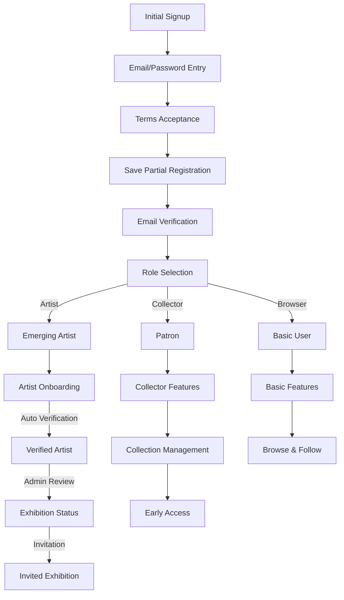

## Registration Flow Diagram

## Registration Steps

1. **Initial Signup**
   - Email and password collection
   - Terms and conditions acceptance
   - Partial registration saved

2. **Email Verification**
   - Verification email sent
   - Redirect to verification page
   - Cleanup of partial registration on success

3. **Role Selection**
   - Three primary paths:
     - **Artist Path**: For creators showcasing work
     - **Collector Path**: For art collectors and patrons
     - **Browser Path**: For general users exploring art

4. **Role-Specific Features**
   
   ### Artist Features
   - Basic portfolio creation
   - Artist profile setup
   - Verification pathway
   - Advanced features (post-verification):
     - Sales management
     - Analytics
     - Gallery integration

   ### Collector (Patron) Features
   - Art collection tools
   - Direct artist messaging
   - Artist following
   - Advanced features:
     - Collection management
     - Early access
     - Private galleries

   ### Basic User Features
   - Art browsing
   - Artist following
   - Basic interaction
   - Community features:
     - Public comments
     - Favorites
     - Basic profile

5. **Data Flow**
   - Partial registration stored during signup
   - Role selection saved to user profile
   - Feature access based on selected role