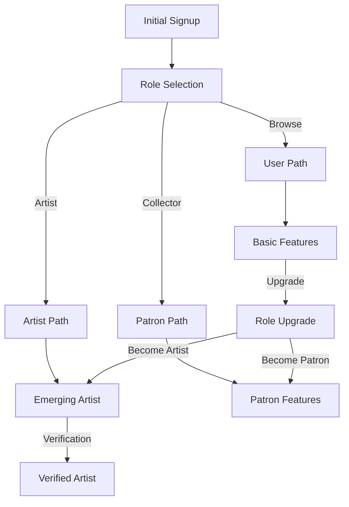

# Role System Implementation Guide

## Database Structure

### Roles and Types
```sql
-- Enum types
CREATE TYPE public.user_role AS ENUM (
  'admin',           -- Platform administrator
  'verified_artist', -- Verified artist with full features
  'emerging_artist', -- Artist in verification process
  'patron',         -- Art collector/enthusiast
  'user'            -- Basic platform user
);

-- Profile columns
role: public.user_role
artist_type: 'verified' | 'emerging' | null
verification_status: 'pending' | 'approved' | 'rejected' | null
```

### Assistant Personas
```typescript
type AssistantPersona = 'curator' | 'mentor' | 'collector' | 'advisor'

// Role to Persona mapping
const personaMapping: Record<UserRole, AssistantPersona> = {
  admin: 'advisor',           // Platform oversight & management
  verified_artist: 'mentor',  // Professional development & guidance
  emerging_artist: 'mentor',  // Growth & verification guidance
  patron: 'collector',        // Art collection & appreciation
  user: 'curator'            // Basic platform exploration
}
```

### Role Features Matrix
```typescript
interface RoleFeatures {
  portfolio: {
    maxArtworks: number;
    customization: boolean;
    analytics: boolean;
  };
  sales: {
    canSell: boolean;
    stripeEnabled: boolean;
    analytics: boolean;
  };
  communication: {
    directMessaging: boolean;
    inquiryManagement: boolean;
    notifications: boolean;
  };
  verification: {
    canApply: boolean;
    canVerify: boolean;
    progressTracking: boolean;
  };
  exhibition: {
    canAccess: boolean;      // Controlled by exhibition_badge, not role
    canSubmit: boolean;
    canManage: boolean;
  };
  admin: {
    platformManagement: boolean;
    userManagement: boolean;
    analytics: boolean;
  };
}

const roleFeatures: Record<UserRole, RoleFeatures> = {
  admin: {
    portfolio: { maxArtworks: Infinity, customization: true, analytics: true },
    sales: { canSell: false, stripeEnabled: false, analytics: true },
    communication: { directMessaging: true, inquiryManagement: true, notifications: true },
    verification: { canApply: false, canVerify: true, progressTracking: true },
    exhibition: { canAccess: true, canSubmit: false, canManage: true },
    admin: { platformManagement: true, userManagement: true, analytics: true }
  },
  verified_artist: {
    portfolio: { maxArtworks: 100, customization: true, analytics: true },
    sales: { canSell: true, stripeEnabled: true, analytics: true },
    communication: { directMessaging: true, inquiryManagement: true, notifications: true },
    verification: { canApply: false, canVerify: false, progressTracking: false },
    exhibition: { canAccess: false, canSubmit: true, canManage: false }, // canAccess controlled by exhibition_badge
    admin: { platformManagement: false, userManagement: false, analytics: false }
  },
  emerging_artist: {
    portfolio: { maxArtworks: 10, customization: false, analytics: false },
    sales: { canSell: false, stripeEnabled: false, analytics: false },
    communication: { directMessaging: false, inquiryManagement: false, notifications: true },
    verification: { canApply: true, canVerify: false, progressTracking: true },
    exhibition: { canAccess: false, canSubmit: false, canManage: false },
    admin: { platformManagement: false, userManagement: false, analytics: false }
  },
  patron: {
    portfolio: { maxArtworks: 0, customization: false, analytics: false },
    sales: { canSell: false, stripeEnabled: true, analytics: false },
    communication: { directMessaging: true, inquiryManagement: true, notifications: true },
    verification: { canApply: false, canVerify: false, progressTracking: false },
    exhibition: { canAccess: false, canSubmit: false, canManage: false },
    admin: { platformManagement: false, userManagement: false, analytics: false }
  },
  user: {
    portfolio: { maxArtworks: 0, customization: false, analytics: false },
    sales: { canSell: false, stripeEnabled: false, analytics: false },
    communication: { directMessaging: false, inquiryManagement: false, notifications: true },
    verification: { canApply: false, canVerify: false, progressTracking: false },
    exhibition: { canAccess: false, canSubmit: false, canManage: false },
    admin: { platformManagement: false, userManagement: false, analytics: false }
  }
};
```

### Protected Routes Configuration
```typescript
// Route protection configuration
export const PROTECTED_ROUTES = {
  '/artist/gallery': ['verified_artist'], // Exhibition badge also required
  '/analytics': ['admin', 'verified_artist'],
  '/messaging': ['admin', 'verified_artist', 'patron']
} as const;

// Helper to check if a role has access to a route
export const hasRouteAccess = (route: keyof typeof PROTECTED_ROUTES, role: UserRole | null): boolean => {
  if (!role) return false;
  
  // Special case for artist gallery which requires exhibition badge
  if (route === '/artist/gallery') {
    // Exhibition badge check happens in page component
    return role === 'verified_artist';
  }
  
  return PROTECTED_ROUTES[route].includes(role);
};
```

### RLS Policies
```sql
-- Gallery access policy
CREATE POLICY "Gallery access requires exhibition badge"
ON public.gallery_shows
FOR ALL
USING (
  CASE
    WHEN auth.role() = 'admin' THEN true
    WHEN auth.role() = 'verified_artist' AND EXISTS (
      SELECT 1 FROM public.profiles
      WHERE id = auth.uid()
      AND exhibition_badge = true
    ) THEN true
    ELSE false
  END
);

-- Profile viewing
CREATE POLICY "Public profiles are viewable by all"
ON public.profiles
FOR SELECT
USING (
  is_public = true OR 
  auth.uid() = id OR
  public.is_admin(auth.role())
);

-- Messaging access
CREATE POLICY "Messaging between verified artists and patrons"
ON public.messages
FOR ALL
USING (
  public.can_access_feature(auth.role(), 'messaging') AND
  (sender_id = auth.uid() OR recipient_id = auth.uid())
);
```

### Database Views
```sql
-- Role mapping view
CREATE VIEW public.profile_roles AS
SELECT 
  id,
  CASE 
    WHEN role = 'artist' THEN 'verified_artist'::public.user_role
    ELSE role
  END as mapped_role,
  role as original_role,
  artist_type,
  verification_status
FROM public.profiles;

-- Feature access view
CREATE VIEW public.feature_access AS
SELECT 
  id,
  role,
  artist_type,
  verification_status,
  CASE 
    WHEN role = 'admin' THEN true
    WHEN role = 'verified_artist' THEN true
    WHEN role = 'patron' AND feature_key = 'messaging' THEN true
    ELSE false
  END as has_access
FROM public.profiles;
```

### Helper Functions
```sql
-- Artist role check
CREATE OR REPLACE FUNCTION public.is_artist(role_to_check public.user_role)
RETURNS boolean AS $$
BEGIN
  RETURN role_to_check IN ('verified_artist', 'emerging_artist');
END;
$$ LANGUAGE plpgsql;

-- Patron role check
CREATE OR REPLACE FUNCTION public.is_patron(role_to_check public.user_role)
RETURNS boolean AS $$
BEGIN
  RETURN role_to_check = 'patron';
END;
$$ LANGUAGE plpgsql;

-- Admin role check
CREATE OR REPLACE FUNCTION public.is_admin(role_to_check public.user_role)
RETURNS boolean AS $$
BEGIN
  RETURN role_to_check = 'admin';
END;
$$ LANGUAGE plpgsql;

-- Feature access check
CREATE OR REPLACE FUNCTION public.can_access_feature(
  user_role public.user_role,
  feature_key text
)
RETURNS boolean AS $$
BEGIN
  RETURN EXISTS (
    SELECT 1 FROM public.feature_access
    WHERE role = user_role
    AND feature_key = feature_key
    AND has_access = true
  );
END;
$$ LANGUAGE plpgsql;
```

## Role-Based Security

### RLS Policies
```sql
-- Artwork management
CREATE POLICY "Artists can manage their artworks"
ON public.artworks
FOR ALL
USING (
  CASE
    WHEN auth.role() = 'admin' THEN true
    WHEN public.is_artist(auth.role()) AND artist_id = auth.uid() THEN true
    ELSE false
  END
);

-- Profile viewing
CREATE POLICY "Public profiles are viewable by all"
ON public.profiles
FOR SELECT
USING (
  is_public = true OR 
  auth.uid() = id OR
  public.is_admin(auth.role())
);

-- Messaging access
CREATE POLICY "Messaging between verified artists and patrons"
ON public.messages
FOR ALL
USING (
  public.can_access_feature(auth.role(), 'messaging') AND
  (sender_id = auth.uid() OR recipient_id = auth.uid())
);

-- Admin access
CREATE POLICY "Full access for admins"
ON public.admin_features
FOR ALL
USING (
  public.is_admin(auth.role())
);
```

## Role Selection Flow



## Feature Access Implementation

### TypeScript Utilities
```typescript
// Role check utilities
export const isArtist = (role: UserRole) => 
  ['verified_artist', 'emerging_artist'].includes(role);

export const isPatron = (role: UserRole) => role === 'patron';

export const isAdmin = (role: UserRole) => role === 'admin';

// Feature access hook
export const useFeatureAccess = (featureKey: string) => {
  const { role } = useUser();
  return roleFeatures[role]?.[featureKey] ?? false;
};

// Role-based component
export const RoleGate: FC<{
  allowedRoles: UserRole[];
  children: ReactNode;
}> = ({ allowedRoles, children }) => {
  const { role } = useUser();
  if (!allowedRoles.includes(role)) return null;
  return <>{children}</>;
};
```

### API Route Protection
```typescript
// Middleware for role-based API protection
export const withRoleCheck = (
  handler: NextApiHandler,
  allowedRoles: UserRole[]
) => async (req: NextApiRequest, res: NextApiResponse) => {
  const session = await getSession(req);
  if (!session) return res.status(401).json({ error: 'Unauthorized' });
  
  const userRole = session.user.role as UserRole;
  if (!allowedRoles.includes(userRole)) {
    return res.status(403).json({ error: 'Forbidden' });
  }
  
  return handler(req, res);
};

// Usage example
export default withRoleCheck(
  async (req, res) => {
    // Handler implementation
  },
  ['admin', 'verified_artist']
);
```

## Best Practices

### 1. Role Checks
```typescript
// Use helper functions consistently
const canManageArtwork = isArtist(userRole) || isAdmin(userRole);
const canAccessFeature = useFeatureAccess('messaging');

// For AI context
const aiPersona = personaMapping[userRole];
```

### 2. Feature Access
```typescript
// Component-level protection
<RoleGate allowedRoles={['admin', 'verified_artist']}>
  <ProtectedFeature />
</RoleGate>

// API-level protection
export const handler = withRoleCheck(
  async (req, res) => {
    // Protected logic
  },
  ['admin', 'verified_artist']
);
```

### 3. Database Operations
```typescript
// Use RLS policies
const { data, error } = await supabase
  .from('artworks')
  .select('*')
  // RLS will automatically filter based on role

// Explicit role checks when needed
if (isAdmin(userRole)) {
  // Admin-specific operations
}
```

## Migration Guidelines

When implementing new features:
1. Update role features matrix
2. Add appropriate RLS policies
3. Create helper functions if needed
4. Update UI components for role awareness
5. Add API route protection
6. Update AI persona behavior

## Implementation Checklist

### Security
- [ ] RLS policies for all tables
- [ ] Role-based API protection
- [ ] Feature access controls
- [ ] Admin safeguards

### UI/UX
- [ ] Role-specific navigation
- [ ] Feature gates
- [ ] Upgrade prompts
- [ ] Error boundaries

### Database
- [ ] Role enum updates
- [ ] Helper functions
- [ ] Access views
- [ ] Migration scripts

### AI Integration
- [ ] Persona mapping
- [ ] Role-specific prompts
- [ ] Context awareness
- [ ] Feature integration

### Testing
- [ ] Role-based tests
- [ ] Security testing
- [ ] UI testing
- [ ] API protection tests
``` 