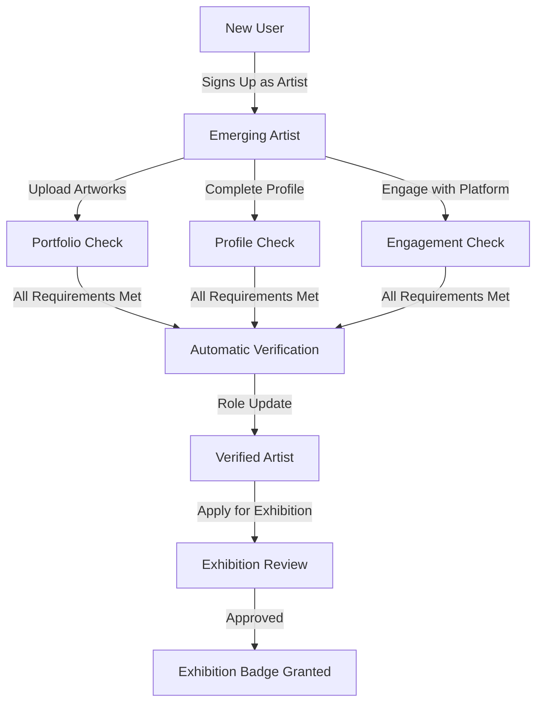

# Artist Verification System

## Overview
The verification system automatically promotes emerging artists to verified status based on measurable criteria. No manual review is required - the system tracks requirements and automatically upgrades artists when all criteria are met. Upon verification, the user's role changes from `emerging_artist` to `verified_artist`.

## Requirements

### 1. Profile Completeness
- Full name
- Professional bio (minimum 100 characters)
- Profile photo/avatar
- At least one social link (website or Instagram)

### 2. Portfolio Quality
- Minimum 5 published artworks
- All artworks must have:
  - Complete descriptions
  - Proper pricing
  - High-quality images
- Maximum artwork limits:
  - Emerging Artist: 10 artworks
  - Verified Artist: 100 artworks

### 3. Platform Engagement
- Account age > 30 days
- Minimum 50 profile views
- Community engagement score >= 50 points

## Engagement Score Calculation

The engagement score is automatically calculated using a weighted point system:

```
Total Score = (followers × 2) + 
              (profile_views × 0.5) + 
              (artwork_favorites × 1) + 
              (gallery_visits × 5)
```

### Point Values
- Each follower: 2 points
- Each profile view: 0.5 points
- Each artwork favorite: 1 point
- Each gallery visit: 5 points

### Automatic Updates
The score updates automatically when:
- Someone follows/unfollows an artist
- Someone favorites/unfavorites an artwork
- An artist receives a gallery visit
- Profile views increase

### Score Implementation
```sql
-- Function to calculate engagement score
CREATE OR REPLACE FUNCTION calculate_engagement_score(user_id UUID)
RETURNS INTEGER AS $$
DECLARE
  follower_count INTEGER;
  view_count INTEGER;
  favorite_count INTEGER;
  visit_count INTEGER;
BEGIN
  -- Get counts from respective tables
  SELECT COUNT(*) INTO follower_count FROM follows WHERE followed_id = user_id;
  SELECT profile_views INTO view_count FROM profiles WHERE id = user_id;
  SELECT COUNT(*) INTO favorite_count FROM artwork_favorites WHERE artwork_id IN (SELECT id FROM artworks WHERE artist_id = user_id);
  SELECT COUNT(*) INTO visit_count FROM gallery_visits WHERE artist_id = user_id;
  
  -- Calculate total score using weights
  RETURN (follower_count * 2) + 
         (view_count * 0.5)::INTEGER + 
         (favorite_count * 1) + 
         (visit_count * 5);
END;
$$ LANGUAGE plpgsql;

-- Trigger to update engagement score
CREATE OR REPLACE FUNCTION update_engagement_score()
RETURNS TRIGGER AS $$
BEGIN
  UPDATE profiles 
  SET community_engagement_score = calculate_engagement_score(NEW.user_id)
  WHERE id = NEW.user_id;
  RETURN NEW;
END;
$$ LANGUAGE plpgsql;

-- Create triggers for each engagement event
CREATE TRIGGER update_score_on_follow
  AFTER INSERT OR DELETE ON follows
  FOR EACH ROW
  EXECUTE FUNCTION update_engagement_score();

CREATE TRIGGER update_score_on_favorite
  AFTER INSERT OR DELETE ON artwork_favorites
  FOR EACH ROW
  EXECUTE FUNCTION update_engagement_score();

CREATE TRIGGER update_score_on_visit
  AFTER INSERT ON gallery_visits
  FOR EACH ROW
  EXECUTE FUNCTION update_engagement_score();

CREATE TRIGGER update_score_on_view
  AFTER UPDATE OF profile_views ON profiles
  FOR EACH ROW
  WHEN (NEW.profile_views <> OLD.profile_views)
  EXECUTE FUNCTION update_engagement_score();
```

## Role Transition

### Emerging → Verified Artist
When all requirements are met:
1. Role updates from `emerging_artist` to `verified_artist`
2. New features are unlocked:
   - Analytics access
   - Direct messaging
   - Inquiry management
   - Portfolio customization
   - Stripe integration for sales
3. Artwork limit increases from 10 to 100

### Exhibition Access
- Verified artists can submit exhibition applications
- Exhibition badge is granted upon application approval
- Exhibition badge (not role) controls access to `/artist/gallery`

## Technical Implementation

### Database Structure
```sql
-- Profile table
CREATE TABLE profiles (
  id UUID PRIMARY KEY,
  role public.user_role NOT NULL DEFAULT 'user',
  verification_progress INTEGER DEFAULT 0,
  verification_status TEXT DEFAULT 'pending',
  exhibition_badge BOOLEAN DEFAULT false,
  community_engagement_score INTEGER DEFAULT 0
);

-- Verification requirements tracking
CREATE TYPE verification_requirement AS ENUM (
  'profile_complete',
  'portfolio_quality',
  'platform_engagement'
);

CREATE TABLE verification_progress (
  user_id UUID REFERENCES profiles(id),
  requirement verification_requirement,
  status BOOLEAN DEFAULT false,
  updated_at TIMESTAMPTZ DEFAULT now(),
  PRIMARY KEY (user_id, requirement)
);
```

### Functions
1. `calculate_engagement_score(user_id UUID)`
   - Calculates total engagement score based on the weighted point system
   - Called by triggers when relevant actions occur

2. `check_verification_requirements(user_id UUID)`
   - Checks all verification requirements
   - Updates verification progress
   - Triggers role update when all requirements are met

3. `update_user_role()`
   - Trigger function that handles role transitions
   - Updates role from `emerging_artist` to `verified_artist`
   - Unlocks new features based on role permissions

### Triggers
```sql
-- Update verification progress when requirements change
CREATE TRIGGER on_requirement_update
  AFTER UPDATE ON verification_progress
  FOR EACH ROW
  EXECUTE FUNCTION check_verification_requirements();

-- Update role when all requirements are met
CREATE TRIGGER on_verification_complete
  AFTER UPDATE ON profiles
  WHEN (NEW.verification_status = 'complete')
  EXECUTE FUNCTION update_user_role();
```

## Verification Process Flow



## Best Practices

1. **Role Transitions**
   - Always use role-based permission checks
   - Never hardcode role strings
   - Use `UserRole` type for type safety

2. **Feature Access**
   - Check role permissions via `role-utils.ts`
   - Separate exhibition access from role checks
   - Use proper RLS policies

3. **Progress Tracking**
   - Store detailed progress in database
   - Use efficient database-level counting
   - Keep consistent requirements across UI

## Known Issues & Improvements

### Portfolio Requirements
Now consistently implemented across the system:
```typescript
const ARTWORK_LIMITS = {
  EMERGING: 10,
  VERIFIED: 100
} as const;

const REQUIREMENTS = {
  MIN_PUBLISHED: 5,
  MIN_PROFILE_VIEWS: 50,
  MIN_ENGAGEMENT_SCORE: 50,
  MIN_ACCOUNT_AGE_DAYS: 30
} as const;
```

### Database Queries
Efficient portfolio checking:
```typescript
const { data: counts } = await supabase
  .from('artworks')
  .select('status', { count: 'exact' })
  .eq('user_id', userId)
  .in('status', ['published']);

const publishedCount = counts.length;
const meetsPortfolioRequirement = publishedCount >= REQUIREMENTS.MIN_PUBLISHED;
``` 