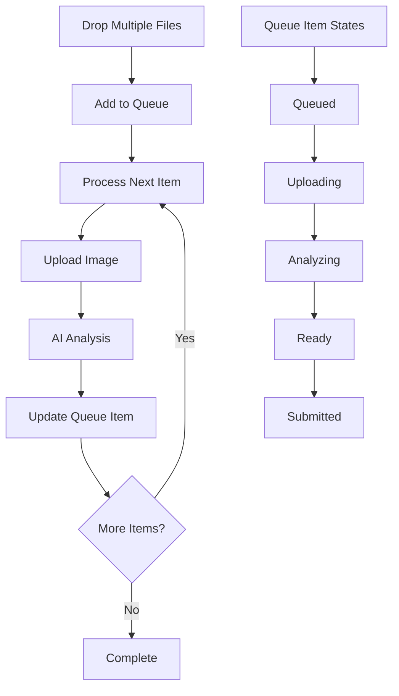

# Multi-Upload Queue System Design [Deferred]

## Overview
This document outlines a design for a multi-upload queue system that maintains our single-artwork submission workflow while allowing artists to queue multiple images for processing. This feature has been deferred for future implementation.

## Current System (Active)
Our current implementation handles single image uploads with:
1. Image upload
2. AI analysis (style detection, content description, keywords)
3. Artist review of AI suggestions
4. Additional metadata input
5. Artwork submission

## Deferred Implementation Details

### Rationale for Deferral
1. Current single-upload system works effectively
2. Complex UX considerations with multi-upload metadata
3. Resource management for multiple AI analyses
4. Need to prioritize core platform features

### Implementation Timeline
- Phase 1: Core platform stabilization (Current)
- Phase 2: Enhanced single-upload improvements
- Phase 3: Multi-upload queue system (Future)

## Proposed Queue System

### Data Structure
```typescript
interface QueuedArtwork {
  file: File;
  status: 'queued' | 'uploading' | 'analyzing' | 'ready' | 'error';
  imageUrl?: string;
  analysis?: {
    description: string;
    styles: string[];
    techniques: string[];
    keywords: string[];
  };
  error?: string;
}
```

### Component Architecture

```typescript
// Main Queue Component
export function ArtworkUploadQueue() {
  const [queue, setQueue] = useState<QueuedArtwork[]>([]);
  const [isProcessing, setIsProcessing] = useState(false);
  const [currentIndex, setCurrentIndex] = useState(0);

  // Queue processing logic
  const processNextInQueue = useCallback(async () => {
    if (currentIndex >= queue.length || isProcessing) return;
    
    setIsProcessing(true);
    const artwork = queue[currentIndex];
    
    try {
      // 1. Upload Image
      const formData = new FormData();
      formData.append('file', artwork.file);
      const uploadResult = await uploadArtworkImage(formData);
      
      if (uploadResult.error) throw new Error(uploadResult.error);
      
      // 2. Trigger AI Analysis
      const analysisFormData = new FormData();
      analysisFormData.append('imageUrl', uploadResult.url);
      const analysisResult = await analyzeArtwork(analysisFormData);
      
      if (analysisResult.error) throw new Error(analysisResult.error);
      
      // 3. Update Queue Item
      setQueue(prev => prev.map((item, idx) => 
        idx === currentIndex 
          ? {
              ...item,
              status: 'ready',
              imageUrl: uploadResult.url,
              analysis: analysisResult.analysis
            }
          : item
      ));
      
    } catch (error) {
      setQueue(prev => prev.map((item, idx) => 
        idx === currentIndex 
          ? { ...item, status: 'error', error: error.message }
          : item
      ));
    } finally {
      setIsProcessing(false);
      setCurrentIndex(prev => prev + 1);
    }
  }, [currentIndex, queue, isProcessing]);
}

// Queue Item Component
function QueueItem({ 
  item, 
  isProcessing,
  onSubmit 
}: { 
  item: QueuedArtwork;
  isProcessing: boolean;
  onSubmit: (data: ArtworkFormData) => Promise<void>;
}) {
  const [isEditing, setIsEditing] = useState(false);

  // Render states based on item status
}
```

## Processing Flow



## Features

### 1. Efficient Processing
- Sequential processing to manage resources
- Automatic queue advancement
- Progress tracking per item
- Error handling and recovery

### 2. User Experience
- Clear status indicators
- Progress visualization
- Error feedback
- Individual artwork forms
- AI suggestion review

### 3. Resource Management
- Controlled API usage
- Sequential processing
- Error recovery
- Progress persistence

### 4. Workflow Steps
1. Artist drops multiple files
2. Files enter processing queue
3. Sequential processing:
   - Image upload
   - AI analysis
   - Results display
4. Artist reviews AI suggestions
5. Artist adds artwork details
6. Individual artwork submission

## Implementation Guidelines

### 1. Component Structure
- Main queue manager component
- Individual queue item components
- Upload dropzone component
- Artwork form component
- Progress indicators

### 2. State Management
- Queue state
- Processing status
- Current item index
- Error handling
- Progress tracking

### 3. Error Handling
- Upload failures
- AI analysis errors
- Network issues
- Invalid files
- Queue state recovery

### 4. Performance Considerations
- Lazy loading of queue items
- Optimistic updates
- Progress persistence
- Resource cleanup

## Future Enhancements

### Phase 1 [Deferred]
- [ ] Queue persistence across sessions
- [ ] Batch metadata application
- [ ] Enhanced error recovery
- [ ] Progress reporting

### Phase 2 [Deferred]
- [ ] Parallel processing options
- [ ] Advanced queue management
- [ ] Batch AI analysis
- [ ] Enhanced progress tracking

### Phase 3 [Deferred]
- [ ] Queue analytics
- [ ] Performance optimizations
- [ ] Enhanced error handling
- [ ] Advanced batch operations

---

suggested improvements:

Below are suggested improvements and considerations for your multi-upload queue system, categorized for clarity. The goal is to help ensure that your system is robust, user-friendly, performant, and maintainable.

---

## 1. **Architecture & Workflow**

- **Queue Flexibility**: Consider allowing for both **sequential** and **parallel** processing, controlled by configuration. For small teams or limited infrastructure, sequential processing is fine. However, in busier scenarios, being able to run a few uploads in parallel can improve overall user experience.  
- **Queue Persistence**: If uploads might be large or if users might navigate away, implementing **server-side persistence** or a local fallback (e.g., localStorage/sessionStorage) can help preserve the queue state across page refreshes or session timeouts.  
- **API-Oriented Workflow**: Consider having a dedicated backend endpoint for receiving and storing “pending” uploads, then separate endpoints for AI analysis triggers. This can future-proof your design if you want to integrate with multiple AI analysis services later.

---

## 2. **State Management**

- **Centralized Store**: If your application has multiple components needing access to the queue state, you might benefit from using a **centralized state management** solution (e.g., Redux or an equivalent). This could simplify synchronization among different UI elements that reflect the queue or upload status.  
- **Error vs. Recovery**: Beyond marking items as `error`, maintain a possible **retriable state** or a “ready for retry” flag. This lets users reattempt failed uploads or analyses without manually re-uploading.  
- **Controlled Re-renders**: For large queues, be mindful of how changes to queue items can cause re-renders. Batched updates and careful memoization can keep performance optimal.

---

## 3. **UI/UX Improvements**

- **Drag-and-Drop Indication**: Provide intuitive drag-and-drop feedback (highlighting or styling) so it’s clear when files can be dropped.  
- **Real-Time Progress**: Offer **visual cues** for each queued item’s progress (e.g., a progress bar). This helps manage user expectations, especially on slower connections or large uploads.  
- **In-Place Metadata Editing**: Once an item has completed analysis, make sure the user can easily edit both the AI suggestions and their own metadata in the same place (e.g., an expanding or modal form).  
- **Confirmation on Success**: Provide a distinct **success state** per item to confirm that the AI analysis and upload completed correctly.  
- **Bulk Actions**: If appropriate, allow for **batch updates** or batch submission if the user wants to apply common metadata across multiple artworks before finalizing.

---

## 4. **Performance & Scalability**

- **Optimized Image Handling**: If images are large, consider compressing or resizing on the **client side** before uploading to reduce bandwidth consumption.  
- **Throttling & Debouncing**: If the user can quickly drag in many files, ensure that your queue processing logic is **throttled** to prevent overloading your servers with simultaneous requests.  
- **Parallel vs. Sequential**: As your user base grows, you may want to provide **configurable concurrency**. Not everything must be processed strictly in one-at-a-time fashion, especially if your server can handle multiple concurrent requests.

---

## 5. **Error Handling & Recovery**

- **Detailed Error Messages**: If an error occurs (e.g., invalid file type, network failure, AI analysis error), show a clear and actionable message. This empowers users to correct issues.  
- **Retry Strategy**: Consider implementing a **retry** mechanism for transient errors (e.g., network timeouts). A simple exponential back-off can be used to automate retries for certain error codes.  
- **Graceful Fallback**: If AI analysis fails, allow the user to proceed with a manual upload and manual metadata entry so their workflow isn’t completely blocked.

---

## 6. **Security & Validation**

- **File Validation**: Perform both **client-side** and **server-side** validation to ensure uploaded files meet your format, size, and type requirements.  
- **Authenticated Requests**: Ensure requests to upload images and trigger AI analysis are properly **secured** (e.g., using secure tokens or an authenticated session).  
- **Access Control**: Restrict access so that only the user who owns the artwork can modify or delete it in the queue.  
- **Secure Storage**: If you are saving images in a cloud service or on a server, make sure you have proper **encryption** at rest, or configure signed URLs with time-limited access.

---

## 7. **Testing & Quality Assurance**

- **Integration Testing**: Test the entire workflow from file drop to final submission, ensuring each step can handle edge cases like network interruptions, file type mismatches, or AI analysis errors.  
- **Unit Testing**: Test the queue logic (e.g., item transitions from `queued` → `uploading` → `analyzing` → `ready`) to confirm the correct flow under different conditions.  
- **Load & Stress Testing**: Ensure that your system can handle spikes (e.g., many files uploaded at once). Check that the queue does not lock up or cause huge delays in processing.  

---

## 8. **Observability & Monitoring**

- **Logging**: At every step (upload, analysis request, success/failure), log meaningful events so that issues can be diagnosed quickly in production.  
- **Metrics**: Track performance metrics such as average upload time, average analysis time, and error rates to spot possible bottlenecks or recurring issues.  
- **Dashboard**: Provide an admin interface or monitoring dashboard to see current queue states, potential errors, and how many items are actively processing.

---

## 9. **Future-Proofing**

- **Interchangeable AI Services**: If you ever need to switch AI analysis providers or add multiple, plan your architecture so that the analysis step can be easily redirected to different endpoints.  
- **Modular & Extensible**: Keep your queue manager logic abstracted so it’s easy to enhance or replace. This is especially helpful if you need to add new steps (e.g., generating AI-driven tags, performing advanced style analysis, or even generating recommendations).  
- **Metadata Standardization**: Establish a metadata schema so that your database can easily handle any additional analysis fields you might introduce in the future without requiring migrations for every new field.

---

### Conclusion
Your design is already solid in terms of a linear, single-file workflow expanded to multiple uploads. By refining these areas—especially around concurrency, error recovery, user experience, and observability—you’ll make the system more robust and user-friendly. Ensuring that your queue can scale, recover gracefully from errors, and integrate smoothly with your AI services will help maintain a strong foundation for future features.