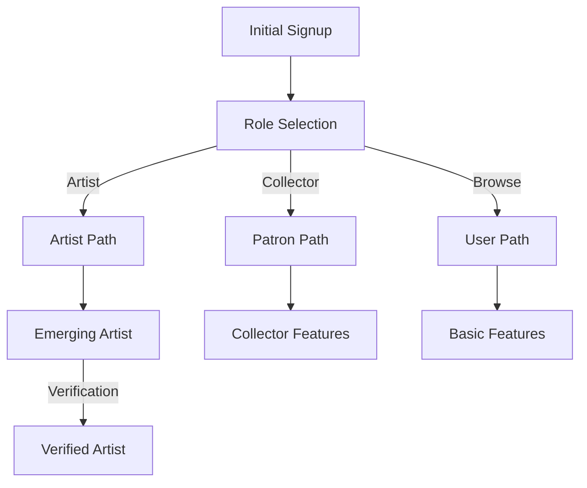

# Role System Implementation Guide

## Database Structure

### Roles and Types
```sql
-- Enum types
public.user_role: 'verified_artist' | 'emerging_artist' | 'patron' | 'user' | 'admin'

-- Profile columns
role: public.user_role
artist_type: 'verified' | 'emerging' | null
```

### Assistant Personas
```typescript
type AssistantPersona = 'curator' | 'mentor' | 'collector' | 'advisor'

// Role to Persona mapping
const personaMapping: Record<UserRole, AssistantPersona> = {
  admin: 'advisor',        // Platform oversight
  emerging_artist: 'mentor',  // Professional development
  verified_artist: 'mentor',  // Professional development
  patron: 'collector',     // Art collection
  user: 'collector'        // Basic exploration
}
```

### Views
```sql
public.profile_roles
- id: UUID
- mapped_role: user_role (maps 'artist' to 'verified_artist' for backward compatibility)
- original_role: user_role (original value)
```

### Helper Functions
```sql
public.is_artist(role_to_check public.user_role) returns boolean
-- Returns true for: 'artist', 'verified_artist', 'emerging_artist'

public.is_collector(role_to_check public.user_role) returns boolean
-- Returns true for: 'patron'
```

## Role-Based Security

### RLS Policies
```sql
-- Example: Artwork updates
CREATE POLICY "Artists can update their own artworks"
ON public.artworks
FOR UPDATE
USING (
  auth.uid() = artist_id AND 
  EXISTS (
    SELECT 1 FROM public.profiles
    WHERE id = auth.uid()
    AND public.is_artist(role)
  )
);

-- Example: Collection access
CREATE POLICY "Collectors can view private galleries"
ON public.galleries
FOR SELECT
USING (
  public.is_collector(auth.role()) OR 
  public.is_artist(auth.role())
);
```

## Role Selection Flow



## Feature Access Matrix
```typescript
const featureAccess = {
  user: {
    canBrowse: true,
    canFollow: true,
    canComment: true
  },
  patron: {
    ...featureAccess.user,
    canCollect: true,
    canMessage: true
  },
  emerging_artist: {
    ...featureAccess.patron,
    canCreatePortfolio: true,
    canSell: true
  }
}
```

## Best Practices

### 1. Role Checks
```typescript
// Preferred: Use helper functions
const isCollector = public.is_collector(role)
const isArtist = public.is_artist(role)

// For AI context
const persona = personaMapping[userRole]
```

### 2. Feature Access
```typescript
// Check role-based access
const canAccessFeature = 
  featureAccess[userRole]?.[featureKey] ?? false;
```

### 3. UI Components
```typescript
// Use role-aware components
<RoleBasedFeature
  requiredRole={['patron', 'emerging_artist', 'verified_artist']}
  fallback={<UpgradePrompt />}
>
  <FeatureContent />
</RoleBasedFeature>
```

## Migration Guidelines

When adding new features:
1. Define access levels for all roles
2. Update RLS policies using role helpers
3. Add to feature access matrix
4. Update UI to reflect role-specific access
5. Consider AI persona behavior

## Implementation Checklist

### Security
- [ ] Update RLS policies for new roles
- [ ] Add collector-specific policies
- [ ] Update role transition triggers
- [ ] Add role validation

### UI/UX
- [ ] Update role selection UI
- [ ] Add collector-specific features
- [ ] Update role badges
- [ ] Add role-based navigation

### Database
- [ ] Add patron role enum
- [ ] Create collector helper functions
- [ ] Update existing views
- [ ] Add role indexes

### AI Integration
- [ ] Implement persona mapping
- [ ] Add context awareness
- [ ] Update AI prompts
- [ ] Add role-specific responses

### Testing
- [ ] Unit tests for new roles
- [ ] Integration tests for personas
- [ ] E2E tests for role flows
- [ ] Security policy tests 