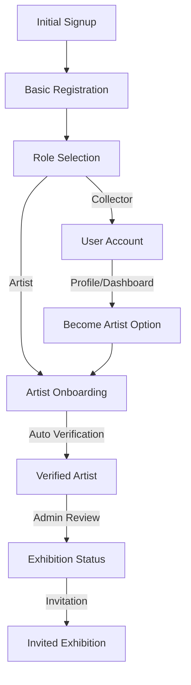

# Role System Implementation Guide

## Database Structure

### Roles and Types
```sql
-- Enum types
public.user_role: 'verified_artist' | 'emerging_artist' | 'user' | 'admin'

-- Profile columns
role: public.user_role
artist_type: 'verified' | 'emerging' | null
```

### Views
```sql
public.profile_roles
- id: UUID
- mapped_role: user_role (maps 'artist' to 'verified_artist' for backward compatibility)
- original_role: user_role (original value)
```

### Helper Functions
```sql
public.is_artist(role_to_check public.user_role) returns boolean
-- Returns true for: 'artist', 'verified_artist', 'emerging_artist'
```

## Role-Based Security

### RLS Policies
```sql
-- Example: Artwork updates
CREATE POLICY "Artists can update their own artworks"
ON public.artworks
FOR UPDATE
USING (
  auth.uid() = artist_id AND 
  EXISTS (
    SELECT 1 FROM public.profiles
    WHERE id = auth.uid()
    AND public.is_artist(role)
  )
);
```

## Progress Tracking

### Verification Progress Table
```sql
verification_progress
- current_step: TEXT
- steps_completed: TEXT[]
- next_steps: TEXT[]
- requirements_met: JSONB
```

## Best Practices

### 1. Role Checks
```typescript
// Preferred: Use the is_artist function
WHERE public.is_artist(role)

// Instead of:
WHERE role = 'artist'
```

### 2. Feature Access
```typescript
// Check both role and artist_type
const canAccessFeature = 
  profile.role === 'verified_artist' || 
  (profile.role === 'emerging_artist' && feature.isBasic);
```

### 3. UI Components
```typescript
// Use the ArtistBadge component
<ArtistBadge type={artist.artist_type} />
```

## Backward Compatibility

The system maintains backward compatibility through:
1. The `profile_roles` view that maps old roles to new ones
2. The `is_artist()` function that handles all artist role variations
3. RLS policies that support both old and new role names

## Migration Guidelines

When adding new features:
1. Define access levels for both artist tiers
2. Update RLS policies using `is_artist()`
3. Use the `profile_roles` view for role mapping
4. Add feature flags to `artist_features` table
5. Update UI to reflect role-specific access

## Registration Flow



## Implementation Checklist

### Security
- [ ] Implement all RLS policies
- [ ] Set up role transition triggers
- [ ] Add audit logging for role changes
- [ ] Test security boundaries

### UI/UX
- [ ] Implement role badges
- [ ] Add feature gates
- [ ] Create role-specific layouts
- [ ] Add progress indicators

### Database
- [ ] Set up role enums
- [ ] Create helper functions
- [ ] Implement views
- [ ] Add indexes for performance

### Testing
- [ ] Unit tests for helper functions
- [ ] Integration tests for role transitions
- [ ] E2E tests for user journeys
- [ ] Security policy tests 