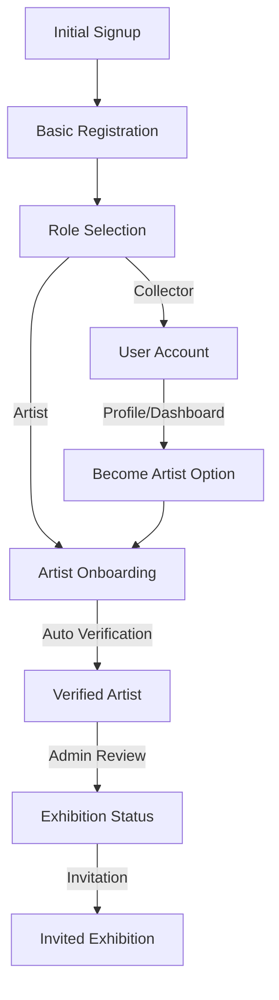

# Master Development Roadmap

## Table of Contents
1. [Project Overview](#1-project-overview)
   - [Core Principles & Best Practices](#core-principles--best-practices)
   - [Registration Flow Diagram](#registration-flow-diagram)
   - [Technical Architecture](#technical-architecture)

2. [Implementation Status](#2-implementation-status)
   - [Completed Features ✅](#completed-features-)
   - [Partially Implemented ⚠️](#partially-implemented-)
   - [In Progress 🚧](#in-progress-)
   - [Future Enhancements 🔮](#future-enhancements-)

3. [Technical Documentation](#3-technical-documentation)
   - [Technical Implementation Focus](#technical-implementation-focus)
   - [Security Considerations](#security-implementation)
   - [Performance Optimizations](#performance-optimizations)
   - [Analytics & Monitoring](#analytics--monitoring)

4. [Feature Requirements](#4-feature-requirements)
   - [Verification Requirements](#verification-requirements)
   - [Educational Components](#educational-components)
   - [Platform Engagement](#platform-engagement)

5. [Discussion Points](#5-discussion-points)
   - [Access & Features](#access--features)
   - [Future Considerations](#future-considerations)

## 1. Project Overview

## Core Principles & Best Practices

### User Experience Guidelines
1. **Progressive Disclosure**
   - Start with essential information only
   - Introduce advanced features gradually
   - Use "Learn More" patterns for detailed information
   - Implement tooltips and micro-guides for contextual help

2. **Friction Reduction**
   - Minimize required fields during initial signup
   - Consolidate Terms & Privacy acceptance
   - Implement progress persistence
   - Provide clear progress indicators
   - Allow completion of non-essential settings later

3. **Role Selection Strategy**
   - Default to collector role for quick onboarding
   - Present clear, visual role comparisons
   - Focus on immediate benefits
   - Allow role changes post-registration

4. **Educational Approach**
   - Use tooltips for immediate context
   - Implement progressive feature introduction
   - Keep main interface clean and focused
   - Move detailed guides to Knowledge Base
   - Provide visual cues for next steps

### Technical Implementation Focus
1. **Core Infrastructure**
   - [x] Robust authentication system
   - [x] Role-based access control
   - [x] Progress tracking and persistence
   - [x] Notification system integration

2. **Data Management**
   - [x] Centralized user preferences
   - [x] Consistent role terminology
   - [x] Progress tracking metrics
   - [x] Activity logging

3. **Integration Points**
   - [x] Email notification system
   - [x] Analytics tracking
     - [x] Server-side tracking
     - [x] Client-side events
     - [x] Error tracking
     - [x] Performance monitoring
   - [x] Payment system integration
   - [x] Gallery system integration

4. **Future Scalability**
   - [x] Modular feature implementation
   - [x] Extensible role system
   - [x] Analytics foundation
     - [x] User sessions
     - [x] Event tracking
     - [x] Feature usage
     - [x] Role conversions
   - [x] API-first approach

## 3. Technical Documentation

### Technical Architecture
1. **Database Schema**
   - [x] Core artist information
   - [x] Artist portfolios
   - [x] Analytics events
   - [x] Feature tracking

2. **API Routes**
   - [x] Artist directory endpoints
   - [x] Individual artist endpoints
   - [x] Analytics tracking endpoints

3. **Core Components**
   - [x] Artist directory components
   - [x] Search and filter controls
   - [x] Analytics tracking components

4. **Security Implementation**
   - [x] Input validation
   - [x] Rate limiting
   - [x] Data encryption
   - [x] Access control
   - [x] Error handling
   - [x] API security
   - [x] Data privacy
   - [x] Audit logging

### Technical Implementation Focus
1. **Core Infrastructure**
   - [x] Robust authentication system
   - [x] Role-based access control
   - [x] Progress tracking and persistence
   - [x] Notification system integration

2. **Data Management**
   - [x] Centralized user preferences
   - [x] Consistent role terminology
   - [x] Progress tracking metrics
   - [x] Activity logging

3. **Integration Points**
   - [x] Email notification system
   - [x] Analytics tracking
     - [x] Server-side tracking
     - [x] Client-side events
     - [x] Error tracking
     - [x] Performance monitoring
   - [x] Payment system integration
   - [x] Gallery system integration

4. **Future Scalability**
   - [x] Modular feature implementation
   - [x] Extensible role system
   - [x] Analytics foundation
     - [x] User sessions
     - [x] Event tracking
     - [x] Feature usage
     - [x] Role conversions
   - [x] API-first approach

### Performance Optimizations
- [x] Search optimization
- [x] Pagination caching
- [x] Filter performance
- [x] Image optimization
  - [x] Next.js Image component
  - [x] Remote patterns configuration
  - [x] Proper domain setup
  - [x] Loading states
  - [x] Fallback handling
- [x] Data prefetching
- [x] Query optimization

### Analytics & Monitoring
- [x] Server-side analytics tracking
- [x] Client-side event tracking
- [x] Error monitoring and recovery
- [x] Performance metrics
- [x] Business intelligence dashboards
- [x] User journey analysis
- [x] Feature usage tracking
- [x] Resource utilization monitoring

## Registration Flow Diagram

## 2. Implementation Status

### Completed Features ✅

### Core Platform & Infrastructure
1. **Authentication & Security**
   - [x] Next.js 14 App Router with TypeScript
   - [x] Supabase integration (Auth, Database, Storage)
   - [x] Role-based access control
   - [x] Protected routes
   - [x] Basic RLS policies
   - [x] Input validation with Zod
   - [x] Rate limiting implementation
   - [x] Error tracking setup (Sentry)

2. **UI/UX Foundation**
   - [x] TailwindCSS with shadcn/ui components
   - [x] Dark mode support
   - [x] Toast notification system
   - [x] Loading states & skeleton loaders
   - [x] Enhanced error handling
   - [x] Responsive enhancements

3. **Core Analytics**
   - [x] User sessions and interactions
   - [x] Feature usage and adoption
   - [x] Error tracking and recovery
   - [x] Performance monitoring
   - [x] Business intelligence metrics
   - [x] Page view tracking
     - Homepage, Gallery, Artists directory
     - Individual artist/artwork pages
   - [x] User journey tracking
     - Registration steps
     - Role selection
     - Profile completion
     - Artist verification
   - [x] Error handling
     - Profile fetch errors
     - Auth state errors
     - Image loading errors
     - Network errors
     - Recovery flows

### User System Implementation
1. **Registration & Onboarding**
   - [x] Email/password signup
   - [x] Email verification
   - [x] Password reset flow
   - [x] Progress tracking
   - [x] Role selection system
   - [x] Initial access features

2. **Non-user Features**
   - [x] Browse featured artists
   - [x] Sign up functionality
   - [x] Basic platform navigation

3. **Collector Features**
   - [x] Browse featured artists
   - [x] View artist profiles
   - [x] View and purchase artwork
   - [x] Follow artists
   - [x] Profile management
   - [x] Commission art system

4. **Artist Features**
   - [x] Two-tier system (Emerging/Verified)
   - [x] Profile management
   - [x] Portfolio features
   - [x] Status tracking
   - [x] Email notifications
   - [x] Basic analytics tracking

5. **Artist Browse System**
   - [x] Artist Directory
     - [x] Grid view of artist profiles
     - [x] Infinite scroll pagination
     - [x] Search and filtering capabilities
     - [x] Sort by various criteria
     - [x] Image optimization
     - [x] Error handling
     - [x] Loading states
   - [x] Artist Profiles
     - [x] Detailed artist information
     - [x] Portfolio showcase
     - [x] Contact information
     - [x] Social media links
     - [x] Profile analytics
   - [x] Featured Artist System
     - [x] Admin-controlled selection
     - [x] Automatic random selection fallback
     - [x] Featured artist showcase
     - [x] Expandable artist bio
   - [x] Social Features
     - [x] Follow system
     - [x] Favorite system
     - [x] Follow/unfollow actions
     - [x] Optimistic updates
     - [ ] Activity feed

6. **Performance Optimizations**
   - [x] Search optimization
   - [x] Pagination caching
   - [x] Filter performance
   - [x] Image optimization
     - [x] Next.js Image component
     - [x] Remote patterns configuration
     - [x] Proper domain setup
     - [x] Loading states
     - [x] Fallback handling
   - [x] Data prefetching
   - [x] Query optimization

### Core Features
1. **Artwork Management**
   - [x] Publishing workflow
   - [x] Gallery view
     - [x] Individual artist profile gallery
     - [x] Main marketplace gallery
     - [x] Artwork reordering with drag-and-drop
     - [ ] Advanced filtering/sorting
     - [ ] Grid/List view toggle
     - [ ] Enhanced responsive design
   - [x] Basic artwork metadata
   - [x] Portfolio management
     - [x] Basic CRUD operations
     - [x] Image preview and reordering
     - [x] Drag-and-drop functionality
     - [x] Optimistic updates
     - [x] Order persistence
   - [Deferred] Multi-image upload system (Deferred for future implementation)

2. **Payment & Sales**
   - [x] Stripe Connect Express integration
   - [x] Payment intent creation
   - [x] Fee calculations
   - [x] Webhook handling
   - [x] Transaction recording
   - [x] Artist payout system
   - [x] Sales reporting

3. **Exhibition System**
   - [x] Application system
   - [x] Admin review interface
   - [x] Exhibition badge implementation
   - [x] Exhibition tools
   - [x] QR code generation

4. **AI Integration**
   - [x] Google Cloud Project setup
   - [x] Basic artwork analysis
   - [x] Image processing pipeline
   - [x] Style detection
   - [x] Description generation
   - [x] Smart search suggestions
   - [x] Personalized recommendations
   - [x] Portfolio optimization tips
   - [x] Market trend insights
   - [x] Content moderation
   - [x] Marketing materials generation
   - [x] Google Gemini integration
   - [x] AI chat assistants
   - [x] Real-time AI responses

### Partially Implemented ⚠️
1. **Artwork Management** *(see [Core Features > Artwork Management](#core-features))*
   - [⚠️] Advanced filtering/sorting (Basic filters implemented, needs enhancement)
   - [⚠️] Grid/List view toggle (UI components ready, needs implementation)
   - [⚠️] Enhanced responsive design (Basic responsiveness works, needs refinement)

2. **Artist Directory** *(see [Artist Browse System](#artist-browse-system))*
   - [⚠️] Filter by artist status (Backend implemented, UI needs enhancement)
   - [⚠️] Activity feed (Basic events tracked, feed UI in development)

3. **Platform Engagement** *(see [Platform Engagement Requirements](#platform-engagement))*
   - [⚠️] Profile views threshold (View counting implemented, threshold logic pending)
   - [⚠️] Collector interactions tracking (Basic follows/favorites done, advanced metrics pending)
   - [⚠️] Account age validation (Age tracking works, validation rules pending)
   - [⚠️] Advanced analytics dashboard (Basic metrics available, advanced features in development)

### In Progress 🚧
1. **Verification System** *(see [Verification Requirements](#verification-requirements))*
   - [ ] Unified verification dashboard (Design approved, implementation started)
   - [ ] Feature access controls refinement (Requirements defined)
   - [ ] Role-specific layouts completion (Design phase)
   - [ ] Intuitive requirement display (Wireframes ready)
   - [ ] Portfolio quality assessment (Research phase)
   - [ ] Style categorization (AI model selection in progress)
   - [ ] Platform engagement validation (Requirements gathering)
   - [ ] Gamification elements
     - [ ] Achievements system (Design phase)
     - [ ] Progress celebrations (Requirements defined)
     - [ ] Micro-guides and tooltips (Content planning)

2. **Platform Features** *(see [Platform Features](#platform-features))*
   - [ ] Community participation metrics (Requirements gathering)
   - [ ] Physical gallery check-in (Research phase)
   - [ ] Exhibition space management (Design phase)
   - [ ] Event scheduling (Requirements defined)
   - [ ] Duration preferences (Design phase)
   - [ ] Social media integration (API research)

### Deferred Items [Deferred]
1. **Exhibition Features**
   - [Deferred] Opening event planning (Planned for Phase 2)
   - [Deferred] Virtual exhibition tools (Requires VR infrastructure)

2. **Testing & Documentation**
   - [Deferred] Core component tests (Scheduled for Q2)
   - [Deferred] Payment flow tests (After Stripe v2 migration)
   - [Deferred] Critical path E2E tests (After core tests)
   - [Deferred] API documentation (After v1 stabilization)
   - [Deferred] Deployment guide (After CI/CD setup)

3. **Social Features**
   - [Deferred] Artist messaging system (After core features)
   - [Deferred] Advanced social integrations (Phase 2 feature)

### Future Enhancements 🔮

### Phase 1: Advanced Features
- [ ] Advanced artwork matching (Research phase)
- [ ] Collection analysis (Requirements gathering)
- [ ] Price analytics (Market research ongoing)
- [ ] Purchase history analysis (Data model planning)
- [ ] Collection recommendations (Algorithm selection)

### Phase 2: Extended Features
- [ ] Virtual reality exhibitions
- [ ] Interactive installations
- [ ] Cross-gallery collaborations
- [ ] Art education content
- [ ] AI-powered exhibition recommendations

### Phase 3: Infrastructure
- [ ] CDN setup
- [ ] AI embedding cache
- [ ] Vector search optimization
- [ ] Advanced testing suite
- [ ] CI/CD pipeline completion

### Phase 4: Role Enhancements
- [ ] Advanced role-based analytics
- [ ] Custom permissions system
- [ ] Role transition automation
- [ ] Feature access marketplace
- [ ] Role-specific AI features

## 4. Feature Requirements

### Verification Requirements *(Implementation Status: [In Progress 🚧](#in-progress-))*
1. **Profile Requirements**
   - [x] Full name and bio (Implemented and validated)
   - [x] Profile photo/avatar (Upload and validation complete)
   - [x] Social links (Integration complete)
   - [x] Contact information (Validation system active)
   - [x] Exhibition history (Data model implemented)

2. **Portfolio Requirements**
   - [x] Minimum 5 artworks (Validation active)
   - [x] High-quality images (Resolution checks implemented)
   - [x] Complete descriptions (Validation system active)
   - [x] Proper pricing (Price validation complete)
   - [x] Multiple artwork views (Gallery system active)
   - [ ] Style categorization (AI model in selection)

3. **Platform Engagement**
   - [⚠️] Account age tracking (Tracking active, 30-day validation pending)
   - [x] Minimum published artworks (3-artwork validation active)
   - [⚠️] Profile views threshold (View counting works, threshold rules pending)
   - [ ] Community participation (Metrics system in design)
   - [⚠️] Collector interactions (Basic tracking active, advanced metrics pending)

4. **Social Media Requirements**
   - [ ] Sharing for extra uploads (Feature design phase)
   - [ ] AI credits distribution (System architecture planning)
   - [ ] Platform promotion (Integration research phase)

### Educational Components *(Related: [Core Principles > Educational Approach](#educational-approach))*
1. **Onboarding Guides**
   - [ ] Best practices guide (Content outline ready)
   - [ ] Portfolio optimization tips (Research phase)
   - [ ] Pricing strategy guide (Market analysis ongoing)
   - [ ] Community engagement guide (Content planning)

2. **Knowledge Base**
   - [ ] Feature documentation (Structure defined)
   - [ ] Tutorial videos (Storyboards in progress)
   - [ ] FAQs (Initial list compiled)
   - [ ] Success stories (Collection phase)

### Platform Engagement *(Related: [Platform Features](#platform-features))*
1. **User Interaction**
   - [x] Follow system (Complete with optimistic updates)
   - [x] Favorite system (Complete with real-time sync)
   - [⚠️] Activity feed (Basic events tracked, UI in development)
   - [ ] Direct messaging (Security design phase)
   - [ ] Community features (Requirements gathering)

2. **Analytics & Tracking**
   - [x] Basic view counts (Real-time tracking active)
   - [x] Engagement metrics (Core metrics implemented)
   - [⚠️] Advanced analytics (Basic dashboard ready, features in development)
   - [ ] Performance insights (Data model planning)

## 5. Discussion Points 💭

### Access & Features *(Related: [User System Implementation](#user-system-implementation))*
1. **Non-user Access Levels** (Under Review)
   - Artist profile visibility (Policy definition phase)
   - Artwork viewing permissions (Access model design)

2. **Collector Features** (Requirements Phase)
   - Direct messaging system (Security review)
   - Advanced interaction capabilities (Feature scoping)

3. **Social Media Integration** (Research Phase)
   - Extra upload incentives (Reward system design)
   - AI credits distribution (Token system planning)
   - Platform promotion strategy (Marketing review)

4. **Role System Evolution** (Architecture Planning)
   - Role transition requirements (Flow design)
   - Feature access granularity (Permission model design)
   - Custom role creation (System architecture)
   - Role-based pricing models (Market analysis)

### Future Considerations *(Related: [Future Enhancements 🔮](#future-enhancements-))*
- [ ] Virtual reality exhibitions
- [ ] Interactive installations
- [ ] Cross-gallery collaborations
- [ ] Art education content
- [ ] AI-powered exhibition recommendations

### Infrastructure *(Related: [Technical Documentation](#3-technical-documentation))*
- [ ] CDN setup
- [ ] AI embedding cache
- [ ] Vector search optimization
- [ ] Advanced testing suite
- [ ] CI/CD pipeline completion

### Role Enhancements *(Related: [Role System Evolution](#role-system-evolution))*
- [ ] Advanced role-based analytics
- [ ] Custom permissions system
- [ ] Role transition automation
- [ ] Feature access marketplace
- [ ] Role-specific AI features 

# Artist Content Management

### Artwork Management vs Portfolio Display
1. **Artwork Management** (`/artist/artworks`)
   - Private management interface for artists
   - Features:
     - [x] Upload and manage artworks
     - [x] Publish/unpublish control
     - [x] Drag-and-drop reordering
     - [x] Image management
       - [x] Multiple images per artwork
       - [x] Primary image selection
       - [x] Image order control
     - [x] Edit artwork details
     - [x] Preview portfolio changes
   - Purpose: Backend control center for artists to manage their content

2. **Portfolio Display** (`/artist/portfolio`)
   - Public-facing presentation layer
   - Features:
     - [x] Professional, curated display
     - [x] Published works only
     - [x] Optimized for viewing
     - [x] Artist brand presentation
     - [x] Custom layout and ordering
   - Purpose: Public storefront for artist's work

### Workflow Integration
- Changes in Artwork Management reflect in Portfolio Display
- Portfolio serves as live preview of public presence
- Clear separation between management and presentation
- Consistent experience across artist types (emerging/verified) 