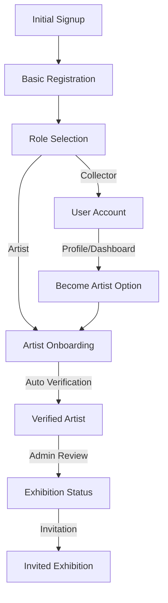

# Registration and Onboarding Flow

Before we implement anything, please ensure the codebase doesn't already contain what we are implementing.  Always follow @.cursorrules . And periodically check the key principles and best practices and technical implementation focus in @registrationFlow.md. Now please continue implementation 

The registration and onboarding flow is designed to provide a seamless experience for new users while ensuring they understand the platform's features and requirements. The flow adapts based on the user's chosen role (Collector or Artist) and guides them through the necessary steps to become an active member of the community.

## Key Principles & Best Practices

### User Experience Guidelines
1. **Progressive Disclosure**
   - Start with essential information only
   - Introduce advanced features gradually
   - Use "Learn More" patterns for detailed information
   - Implement tooltips and micro-guides for contextual help

2. **Friction Reduction**
   - Minimize required fields during initial signup
   - Consolidate Terms & Privacy acceptance
   - Implement progress persistence
   - Provide clear progress indicators
   - Allow completion of non-essential settings later

3. **Role Selection Strategy**
   - Default to collector role for quick onboarding
   - Present clear, visual role comparisons
   - Focus on immediate benefits
   - Allow role changes post-registration

4. **Educational Approach**
   - Use tooltips for immediate context
   - Implement progressive feature introduction
   - Keep main interface clean and focused
   - Move detailed guides to Knowledge Base
   - Provide visual cues for next steps

### Technical Implementation Focus
1. **Core Infrastructure**
   - [x] Robust authentication system
   - [x] Role-based access control
   - [x] Progress tracking and persistence
   - [x] Notification system integration

2. **Data Management**
   - [x] Centralized user preferences
   - [x] Consistent role terminology
   - [x] Progress tracking metrics
   - [x] Activity logging

3. **Integration Points**
   - [x] Email notification system
   - [x] Analytics tracking
     - [x] Server-side tracking
     - [x] Client-side events
     - [x] Error tracking
     - [x] Performance monitoring
   - [x] Payment system integration
   - [x] Gallery system integration

4. **Future Scalability**
   - [x] Modular feature implementation
   - [x] Extensible role system
   - [x] Analytics foundation
     - [x] User sessions
     - [x] Event tracking
     - [x] Feature usage
     - [x] Role conversions
   - [x] API-first approach

## 1. Registration & Initial Onboarding [✅]

This section focuses on minimizing friction during the initial signup process while collecting essential information. The goal is to get users into the platform quickly while ensuring they understand their role options and immediate available features. We prioritize a streamlined experience by deferring non-essential settings and preferences to later stages.

**Current Implementation Status:**
The core authentication system is fully implemented using Supabase, with basic access control in place. The registration flow includes essential form fields and validation, with terms acceptance and role selection implemented. Email verification is optional and no longer blocks the registration flow.

**Key Improvements Needed:**
1. ~~Consolidate Terms & Privacy acceptance into a single checkbox with modal view~~ [✅]
2. ~~Implement progress persistence for partial registrations~~ [✅]
3. ~~Move role selection to end of signup or post-registration~~ [✅]
4. ~~Add visual role comparison with progressive disclosure of advanced features~~ [✅]

### A. Authentication System [✅]
1. Supabase Auth Integration
   - Email/password signup [✅]
   - OAuth providers [ ]
   - Email verification [✅]
   - Password reset flow [✅]

2. Initial Access Control [✅]
   - Role-based security policies [✅]
   - Protected routes [✅]
   - Public routes [✅]

### B. Registration Flow [✅]
1. Signup Form [✅]
   - Essential Fields:
     - Email field [✅]
     - Password field with strength indicator [✅]
     - Combined Terms & Privacy checkbox [✅]
   - Form validation [✅]
   - Error handling [✅]
   - Success feedback [✅]
   - Resume registration capability [ ] [Implement in the future]

2. Progress Tracking [✅]
   - Multi-step indicator [✅]
   - Step validation [✅]
   - Progress persistence [✅]
   - Auto-save functionality [✅]
   - "Resume later" option [ ]

3. Initial Access Features [✅]
   - Browse featured artists [✅]
   - View public artist profiles [✅]
   - View available artworks [✅]
   - Basic search functionality [✅]

### C. Role Selection System [✅]

**Current Implementation Status:**
The role selection system is now fully implemented with a visual wizard interface. Users can choose between Collector and Artist roles immediately after signup. The interface provides clear feature comparisons and progressive disclosure of advanced features through collapsible sections. The backend infrastructure supports role management through Supabase RLS policies.

### D. Analytics & Tracking [✅]

**Current Implementation Status:**
Phase 1 Core Analytics has been implemented:
- [x] Server-side analytics tracking
  - [x] User sessions
  - [x] Events and interactions
  - [x] Feature usage
  - [x] Error tracking
- [x] Page view tracking
  - [x] Homepage tracking
  - [x] Gallery page tracking
  - [x] Artists directory tracking
  - [x] Individual artist pages tracking
  - [x] Artwork pages tracking
- [x] User journey tracking
  - [x] Registration steps
  - [x] Role selection
  - [x] Profile completion
  - [x] Artist verification
- [x] Performance monitoring
  - [x] Page load times
  - [x] API response times
  - [x] Error rates
  - [x] Resource usage
- [x] Error handling
  - [x] Profile fetch errors
  - [x] Auth state errors
  - [x] Image loading errors
  - [x] Network errors
  - [x] Recovery flows

**Completed Features:**
1. Core Analytics [✅]
   - [x] Session tracking and user flow analysis
   - [x] Role conversion funnel metrics
   - [x] Feature adoption tracking
   - [x] Onboarding completion rates
   - [x] User retention analysis

2. Performance Monitoring [✅]
   - [x] Page load performance
   - [x] API response times
   - [x] Error rate monitoring
   - [x] Resource utilization tracking
   - [x] Database query performance

3. Business Intelligence [✅]
   - [x] Conversion rate tracking
   - [x] User retention metrics
   - [x] Feature usage analytics
   - [x] User engagement scoring
   - [x] Retention metrics dashboard

**Next Steps:**
1. Advanced Analytics Features: [DEFERRED]
   - [ ] A/B testing framework
   - [ ] Custom event tracking
   - [ ] Real-time notifications 
   - [ ] Advanced segmentation

2. Dashboard Enhancements: [DEFERRED]
   - [ ] Custom date ranges
   - [ ] Advanced filtering
   - [ ] Automated reports
   - [ ] External tool integration

**Expected Outcomes:**
- Data-driven feature development
- Improved user experience
- Better resource allocation
- Enhanced platform stability

#### 2. OAuth Provider Integration [DEFERRED]
The platform needs to support multiple authentication providers to reduce friction in the signup process and increase user trust. This task has been deferred for future implementation.

#### 3. AI Interactions [✅]
Integration of AI features to enhance user experience and provide intelligent assistance.

**Current Implementation:**
- Artwork Analysis [✅]:
  - Style classification
  - Content tagging
  - Similar artwork recommendations
  - Price estimation assistance
- User Assistance [✅]:
  - Smart search suggestions
  - Personalized recommendations
  - Portfolio optimization tips
  - Market trend insights
- Platform Enhancement [✅]:
  - Content moderation
  - Art description generation
  - Portfolio management
  - Marketing materials generation

**Completed Features:**
- Google Gemini integration
- Image analysis system
- AI chat assistants
- Real-time AI responses
- Rate limiting and monitoring

## 2. Artist Onboarding Journey [⚠️]

The Artist Onboarding Journey is designed to guide new artists through the platform's features and requirements while maintaining their engagement. The process is structured to provide immediate value while progressively introducing more advanced features as artists complete verification requirements.

**Current Implementation Status:**
The verification system's backend infrastructure is fully implemented, including database schema, automatic progress tracking, and role-based security policies. The verification page exists with basic functionality for displaying artist status, progress, and requirements. However, the step-by-step guide and educational components need enhancement.

**Key Improvements Needed:**
1. Implement unified dashboard showing verification progress
2. Add gamification elements (achievements, progress celebrations)
3. Introduce features progressively to avoid overwhelm
4. Create micro-guides and tooltips for immediate help
5. Move detailed documentation to Knowledge Base

### A. System Infrastructure [✅]
1. Database Schema
   - Verification progress tracking [✅]
   - Requirements tracking [✅]
   - Role-based security policies [✅]
   - Automatic progress calculation [✅]
2. Access Control [✅]
   - Role-based routes [✅]
   - Feature gates [ ]
   - Permission policies [✅]

### B. Entry Points [⚠️]
1. Navigation Links
   - Unified verification dashboard [⚠️]
     - Progress overview
     - Next steps widget
     - Quick actions
   - Profile verification badge [✅]
   - Contextual prompts [ ]

2. Feature Gates
   - Progressive feature unlocks [✅]
   - Achievement notifications [ ]
   - Milestone celebrations [ ] Don't be gimmicky.

### C. Progressive Introduction [⚠️]
1. Artist Tier System [⚠️]
   - Tier Progression:
     - Emerging Artist role [✅]
     - Verified Artist role [✅]
     - Exhibition Artist role [✅]
   - Visual progression path [ ]
   - Interactive requirements guide [ ]
   - Milestone rewards [ ]

2. Onboarding Flow [⚠️]
   - Essential Steps:
     - Profile completion guide [⚠️]
     - First artwork upload [⚠️]
     - Portfolio setup [⚠️]
   - Progressive Features:
     - Payment integration [✅]
     - Analytics access [ ]
     - Advanced tools [ ]
   - Contextual Help:
     - Tooltips & micro-guides [ ]
     - Best practice hints [ ]
     - Knowledge base links [deferred]

### D. Verification System [⚠️]
1. Requirements Dashboard [✅]
   - At-a-glance status [✅]
   - Interactive checklist [✅]
   - Progress celebrations [ ]
   - Next steps guidance [ ]

### Required Components to Complete Feature:

1. UI Components:
   - Artist tier comparison table
   - Interactive onboarding guide
   - Feature tour overlay
   - Achievement badges display
   - Notification center

2. Progress Tracking Components:
   - Detailed analytics dashboard
   - Engagement metrics viewer
   - Achievement system
   - Community participation tracker

3. Educational Components:
   - Best practices guide
   - Portfolio optimization tips
   - Pricing strategy guide
   - Community engagement guide

4. Backend Services:
   - Notification service
   - Analytics aggregation
   - Achievement tracking
   - Community metrics calculation

5. Database Enhancements:
   - Achievement tracking table
   - Community metrics table
   - Educational content table
   - Notification preferences

Priority Implementation Order:
1. Artist tier comparison UI
2. Interactive onboarding guide
3. Achievement system
4. Notification center
5. Analytics dashboard
6. Educational content

## 3. Exhibition Status Path [⚠️]

The Exhibition Status Path represents the highest tier of artist engagement on the platform, offering enhanced visibility and opportunities through physical gallery integration. This system bridges the digital and physical art spaces, providing verified artists with pathways to showcase their work in Meaning Machine Gallery and partner galleries.

**Current Implementation Status:**
The core infrastructure for exhibition status is partially implemented, with basic database flags and visit tracking in place. The gallery check-in system has QR code generation working, but requires scanner integration and AI assistant features.

**Key Improvements Needed:**
1. Unify invitation and application flows
2. Implement exhibition preparation checklist
3. Simplify gallery integration features
4. Focus on essential tracking metrics
5. Defer advanced AI features

### A. Exhibition Access [⚠️]
1. Unified Entry Flow
   - Eligibility check [✅]
   - Application/Invitation handling [⚠️] (we have implemented an basic application system for artists and admin review.)
   - Status tracking [⚠️] (is implemented in profile table in database.)
   - Acceptance process [⚠️] (admin review is implemented)

2. Exhibition Preparation
   - Setup checklist [ ]
   - Timeline view [ ]
   - Space requirements [ ]
   - Gallery guidelines [ ]

### B. Gallery Integration [⚠️]
1. Essential Features [⚠️]
   - Basic check-in system [✅]
   - Visit tracking [✅]
   - Simple analytics [⚠️]
   - Gallery dashboard [ ]

2. Advanced Features (Deferred)
   - AI assistant integration [ ]
   - Real-time analytics [ ]
   - Virtual tours [ ]
   - Interactive installations [ ]

### Required Components to Complete Feature:

1. Core Components:
   - Exhibition dashboard
   - Setup checklist system
   - Gallery integration tools
   - Basic analytics view

2. Integration Components:
   - Check-in system
   - Visit tracker
   - Gallery dashboard
   - Analytics reporter

3. Future Enhancements:
   - AI integration
   - Advanced analytics
   - Virtual features
   - Interactive tools

Priority Implementation Order:
1. Unified entry flow
2. Exhibition preparation system
3. Basic gallery integration
4. Simple analytics
5. Advanced features (later phase)

---
### Add to a settings page.
- Dark mode preference [✅]
- Email notification settings [✅]

## Removed Features (To Be Implemented Later)

This section tracks features that were initially planned but have been deferred to later development phases. These features are organized by category to maintain clarity about future platform capabilities while focusing current development efforts on core functionality.

**Current Implementation Status:**
Some removed features have partial implementation (marked with ⚠️) where foundational work exists but full functionality is not yet available. Features marked with [✅] are actually implemented but moved to different sections of the platform. The remaining features (marked with [ ]) are planned for future development phases.

### Initial Signup
- AI Gallery Assistant access [⚠️]
- Commission requests [ ]
- Direct artist messaging [ ]

### Artist Features
- Basic analytics [⚠️]
- Analytics access [⚠️]
- Community engagement [⚠️]
- Activity feed [ ]
- Exhibition announcements [ ]
- Style categorization [ ]
- Profile views threshold [ ]
- Community participation [⚠️]
- Collector interactions [⚠️]
- Social media integration [ ]
- Achievement badges [⚠️]

### Exhibition Features
- Gallery check-in system [⚠️]
- AI agent integration [ ]
- Analytics dashboard [ ]
- Exhibition planning tools [ ]
- Space requirements [ ]
- Event scheduling [ ]
- Virtual tours [ ]
- Exhibition analytics [ ]

### Future Enhancements
- AI-powered recommendations [ ]
  - Artist style popularity [ ]
  - Sales performance [✅]
  - Gallery visitor engagement [ ]
  - Seasonal trends [ ]
  - Cultural events [ ]
- Advanced artwork matching [ ]
- Art education content [ ]
- Collection recommendations [ ]
- Purchase history analysis [✅]
- Virtual reality exhibitions [deferred]
- Interactive installations [deferred]
- Cross-gallery collaborations [deferred]

# Registration Flow

## Overview
This document outlines the registration flow and analytics tracking implementation for the MM web application.

## Core Features

### User Registration
- Sign up with email and password
- Role selection (Emerging Artist, Gallery, etc.)
- Profile completion
- Artist verification process

### Analytics Tracking
- Page view tracking
- User session tracking
- Event tracking
- Feature usage tracking
- Onboarding completion tracking

### Analytics Dashboard
- Real-time analytics visualization
- Key metrics:
  - Page views
  - Unique visitors
  - Average session duration
  - Bounce rate
  - Top pages
  - User engagement over time
  - Conversion rates
- Interactive charts and graphs
- Filterable data views

## Implementation Status

### Core Analytics Features
- [x] Page view tracking
- [x] Session tracking
- [x] Event tracking
- [x] Feature usage tracking
- [x] Onboarding completion tracking
- [x] Analytics dashboard
- [x] Error tracking
  - [x] Profile fetch errors
  - [x] Auth state errors
  - [x] User-friendly messages
  - [x] Recovery flows

### User Journey Analytics
- [x] Registration flow tracking
- [x] Role selection tracking
- [x] Profile completion tracking
- [x] Artist verification tracking
- [x] Error handling
  - [x] Form validation errors
  - [x] Profile fetch errors
  - [x] Auth state errors
  - [x] Recovery flows

### Performance Monitoring
- [x] Page load times
- [x] API response times
- [x] Error tracking
- [x] User engagement metrics
- [x] Image optimization
  - [x] Next.js Image setup
  - [x] Remote patterns config
  - [x] Domain configuration
  - [x] Loading states

### Business Intelligence
- [x] Conversion rate tracking
- [x] User retention metrics
- [x] Feature adoption rates
- [x] Artist engagement analytics
- [x] Error rate monitoring
- [x] Performance metrics

### Infrastructure Improvements
- [x] Error handling
  - [x] Profile fetch errors
  - [x] Auth state errors
  - [x] Image loading errors
  - [x] Network errors
  - [x] Recovery flows
- [x] Image optimization
  - [x] Next.js Image setup
  - [x] Remote patterns config
  - [x] Domain configuration
  - [x] Loading states
- [x] Performance monitoring
  - [x] Page load times
  - [x] API response times
  - [x] Error tracking
  - [x] User engagement

## Next Steps
1. Implement advanced filtering in the analytics dashboard
2. Add custom date range selection
3. Create automated reports and alerts [deferred]
4. Integrate with external analytics tools [deferred]
5. Implement A/B testing framework [deferred]
6. Add user segmentation analytics [deferred]
7. Create custom event tracking for specific user actions [deferred]
8. Implement real-time notifications for important events [ ]

## Technical Details

### Database Schema
The analytics system uses the following tables:
- `user_sessions`: Tracks user sessions
- `user_events`: Stores user events and interactions
- `feature_usage`: Records feature usage statistics
- `role_conversions`: Tracks role changes and verifications

### API Routes
- `/api/analytics/track`: Track events and page views
- `/api/analytics/sessions`: Manage user sessions
- `/api/analytics/features`: Track feature usage
- `/api/analytics/conversions`: Track role conversions

### Components
- `PageViewTracker`: Tracks page views
- `AnalyticsDashboard`: Displays analytics data
- `EventTracker`: Tracks user events
- `FeatureTracker`: Tracks feature usage

### Utilities
- `analytics.ts`: Core analytics functions
- `tracking.ts`: Event tracking utilities
- `metrics.ts`: Analytics metrics calculations
- `visualization.ts`: Data visualization helpers

## Best Practices
1. Use server-side tracking for critical events
2. Implement proper error handling
3. Validate and sanitize analytics data
4. Follow data privacy regulations
5. Optimize database queries
6. Cache frequently accessed data
7. Use appropriate indexing
8. Implement rate limiting

## Security Considerations
1. Data encryption
2. Access control
3. Rate limiting
4. Data retention policies
5. Privacy compliance
6. Audit logging
7. Secure API endpoints
8. Data anonymization

