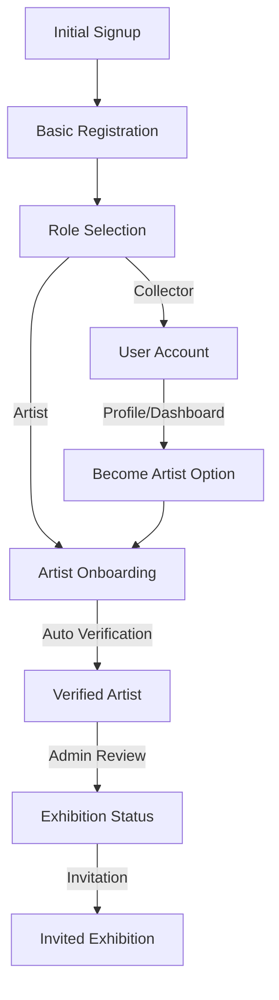

# Registration and Onboarding Flow

Before we implement anything, please ensure the codebase doesn't already contain what we are implementing.  Always follow @.cursorrules . And periodically check the key principles and best practices and technical implementation focus in @registrationFlow.md. Now please continue implementation 

The registration and onboarding flow is designed to provide a seamless experience for new users while ensuring they understand the platform's features and requirements. The flow adapts based on the user's chosen role (Collector or Artist) and guides them through the necessary steps to become an active member of the community.

## Key Principles & Best Practices

### User Experience Guidelines
1. **Progressive Disclosure**
   - Start with essential information only
   - Introduce advanced features gradually
   - Use "Learn More" patterns for detailed information
   - Implement tooltips and micro-guides for contextual help

2. **Friction Reduction**
   - Minimize required fields during initial signup
   - Consolidate Terms & Privacy acceptance
   - Implement progress persistence
   - Provide clear progress indicators
   - Allow completion of non-essential settings later

3. **Role Selection Strategy**
   - Default to collector role for quick onboarding
   - Present clear, visual role comparisons
   - Focus on immediate benefits
   - Allow role changes post-registration

4. **Educational Approach**
   - Use tooltips for immediate context
   - Implement progressive feature introduction
   - Keep main interface clean and focused
   - Move detailed guides to Knowledge Base
   - Provide visual cues for next steps

### Technical Implementation Focus
1. **Core Infrastructure**
   - Robust authentication system
   - Role-based access control
   - Progress tracking and persistence
   - Notification system integration

2. **Data Management**
   - Centralized user preferences
   - Consistent role terminology
   - Progress tracking metrics
   - Activity logging

3. **Integration Points**
   - Email notification system
   - Analytics tracking
   - Payment system integration
   - Gallery system integration

4. **Future Scalability**
   - Modular feature implementation
   - Extensible role system
   - Analytics foundation
   - API-first approach

## 1. Registration & Initial Onboarding [⚠️]

This section focuses on minimizing friction during the initial signup process while collecting essential information. The goal is to get users into the platform quickly while ensuring they understand their role options and immediate available features. We prioritize a streamlined experience by deferring non-essential settings and preferences to later stages.

**Current Implementation Status:**
The core authentication system is fully implemented using Supabase, with email verification and basic access control in place. The registration flow includes essential form fields and validation, but requires additional features like terms acceptance and progress persistence. Role selection UI and automated role management are pending implementation.

**Key Improvements Needed:**
1. Consolidate Terms & Privacy acceptance into a single checkbox with modal view
2. Implement progress persistence for partial registrations
3. Move role selection to end of signup or post-registration
4. Add visual role comparison with progressive disclosure of advanced features

### A. Authentication System [✅]
1. Supabase Auth Integration
   - Email/password signup [✅]
   - OAuth providers [ ]
   - Email verification [✅]
   - Password reset flow [✅]

2. Initial Access Control [✅]
   - Role-based security policies [✅]
   - Protected routes [✅]
   - Public routes [✅]

### B. Registration Flow [⚠️]
1. Signup Form [✅]
   - Essential Fields:
     - Email field [✅]
     - Password field with strength indicator [✅]
     - Combined Terms & Privacy checkbox [✅]
   - Form validation [✅]
   - Error handling [✅]
   - Success feedback [✅]
   - Resume registration capability [ ] [Implement in the future]

2. Progress Tracking [⚠️]
   - Multi-step indicator [✅]
   - Step validation [✅]
   - Progress persistence [✅]
   - Auto-save functionality [✅]
   - "Resume later" option [ ]

3. Initial Access Features [✅]
   - Browse featured artists [✅]
   - View public artist profiles [✅]
   - View available artworks [✅]
   - Basic search functionality [✅]

### C. Role Selection System [⚠️]

**Current Implementation Status:**
The backend infrastructure for roles is implemented through Supabase RLS policies and database schema. Users default to the collector role, with manual role upgrades available. The verification system is in place with email confirmation handled automatically through Supabase configuration.

1. Role Selection UI [⚠️]
   - Simplified role options:
     - Default collector role [✅]
     - Optional artist upgrade [✅]
   - Visual comparison cards [ ]
     - Core features only
     - "Learn more" for advanced features
   - Quick role switch option [ ]

2. Collector Features [⚠️]
   - Immediate Features:
     - Follow artists [✅]
     - Favorite artworks [✅]
     - View artist profiles [✅]
   - Progressive Features:
     - Transaction history [ ]
     - Owned artwork gallery [ ]
     - Collection privacy settings [ ]
   - Advanced Features (Behind "Learn More"):
     - Gallery visit tracking [⚠️]
     - AI interactions [ ]
     - Advanced analytics [ ]

3. Role Management [⚠️]
   - Default role assignment [✅]
   - Role upgrade process [⚠️]
   - Role permissions [✅]
   - Role change history [ ]

### Required Components to Complete Feature:

1. Authentication Enhancements:
   - OAuth provider integration
   - Terms & conditions system
   - Privacy policy management
   - Session management improvements

2. Registration UI Components:
   - Terms acceptance modal
   - Role selection wizard
   - Progress persistence system
   - Registration completion dashboard

3. Collector Features Components:
   - Transaction history viewer
   - Owned artwork gallery
   - Collection privacy controls
   - Gallery visit tracker

4. Backend Services:
   - Role management service
   - User preferences service
   - Activity tracking service
   - Notification service

5. Database Enhancements:
   - User preferences table
   - Role history tracking
   - Activity logging
   - Feature flags system

Priority Implementation Order:
1. Terms & conditions integration
2. Role selection wizard
3. Collection management features
4. Gallery visit system completion
5. OAuth provider integration
6. Advanced tracking features

## 2. Artist Onboarding Journey [⚠️]

The Artist Onboarding Journey is designed to guide new artists through the platform's features and requirements while maintaining their engagement. The process is structured to provide immediate value while progressively introducing more advanced features as artists complete verification requirements.

**Current Implementation Status:**
The verification system's backend infrastructure is fully implemented, including database schema, automatic progress tracking, and role-based security policies. The verification page exists with basic functionality for displaying artist status, progress, and requirements. However, the step-by-step guide and educational components need enhancement.

**Key Improvements Needed:**
1. Implement unified dashboard showing verification progress
2. Add gamification elements (achievements, progress celebrations)
3. Introduce features progressively to avoid overwhelm
4. Create micro-guides and tooltips for immediate help
5. Move detailed documentation to Knowledge Base

### A. System Infrastructure [✅]
1. Database Schema
   - Verification progress tracking [✅]
   - Requirements tracking [✅]
   - Role-based security policies [✅]
   - Automatic progress calculation [✅]
2. Access Control [✅]
   - Role-based routes [✅]
   - Feature gates [ ]
   - Permission policies [✅]

### B. Entry Points [⚠️]
1. Navigation Links
   - Unified verification dashboard [⚠️]
     - Progress overview
     - Next steps widget
     - Quick actions
   - Profile verification badge [✅]
   - Contextual prompts [ ]

2. Feature Gates
   - Progressive feature unlocks [✅]
   - Achievement notifications [ ]
   - Milestone celebrations [ ]

### C. Progressive Introduction [⚠️]
1. Artist Tier System [⚠️]
   - Tier Progression:
     - Emerging Artist role [✅]
     - Verified Artist role [✅]
     - Exhibition Artist role [✅]
   - Visual progression path [ ]
   - Interactive requirements guide [ ]
   - Milestone rewards [ ]

2. Onboarding Flow [⚠️]
   - Essential Steps:
     - Profile completion guide [⚠️]
     - First artwork upload [⚠️]
     - Portfolio setup [⚠️]
   - Progressive Features:
     - Payment integration [✅]
     - Analytics access [ ]
     - Advanced tools [ ]
   - Contextual Help:
     - Tooltips & micro-guides [ ]
     - Best practice hints [ ]
     - Knowledge base links [ ]

### D. Verification System [⚠️]
1. Requirements Dashboard [✅]
   - At-a-glance status [✅]
   - Interactive checklist [✅]
   - Progress celebrations [ ]
   - Next steps guidance [ ]

### Required Components to Complete Feature:

1. UI Components:
   - Artist tier comparison table
   - Interactive onboarding guide
   - Feature tour overlay
   - Achievement badges display
   - Notification center

2. Progress Tracking Components:
   - Detailed analytics dashboard
   - Engagement metrics viewer
   - Achievement system
   - Community participation tracker

3. Educational Components:
   - Best practices guide
   - Portfolio optimization tips
   - Pricing strategy guide
   - Community engagement guide

4. Backend Services:
   - Notification service
   - Analytics aggregation
   - Achievement tracking
   - Community metrics calculation

5. Database Enhancements:
   - Achievement tracking table
   - Community metrics table
   - Educational content table
   - Notification preferences

Priority Implementation Order:
1. Artist tier comparison UI
2. Interactive onboarding guide
3. Achievement system
4. Notification center
5. Analytics dashboard
6. Educational content

## 3. Exhibition Status Path [⚠️]

The Exhibition Status Path represents the highest tier of artist engagement on the platform, offering enhanced visibility and opportunities through physical gallery integration. This system bridges the digital and physical art spaces, providing verified artists with pathways to showcase their work in Meaning Machine Gallery and partner galleries.

**Current Implementation Status:**
The core infrastructure for exhibition status is partially implemented, with basic database flags and visit tracking in place. The gallery check-in system has QR code generation working, but requires scanner integration and AI assistant features.

**Key Improvements Needed:**
1. Unify invitation and application flows
2. Implement exhibition preparation checklist
3. Simplify gallery integration features
4. Focus on essential tracking metrics
5. Defer advanced AI features

### A. Exhibition Access [⚠️]
1. Unified Entry Flow
   - Eligibility check [✅]
   - Application/Invitation handling [⚠️] (we have implemented an basic application system for artists and admin review.)
   - Status tracking [⚠️] (is implemented in profile table in database.)
   - Acceptance process [⚠️] (admin review is implemented)

2. Exhibition Preparation
   - Setup checklist [ ]
   - Timeline view [ ]
   - Space requirements [ ]
   - Gallery guidelines [ ]

### B. Gallery Integration [⚠️]
1. Essential Features [⚠️]
   - Basic check-in system [✅]
   - Visit tracking [✅]
   - Simple analytics [⚠️]
   - Gallery dashboard [ ]

2. Advanced Features (Deferred)
   - AI assistant integration [ ]
   - Real-time analytics [ ]
   - Virtual tours [ ]
   - Interactive installations [ ]

### Required Components to Complete Feature:

1. Core Components:
   - Exhibition dashboard
   - Setup checklist system
   - Gallery integration tools
   - Basic analytics view

2. Integration Components:
   - Check-in system
   - Visit tracker
   - Gallery dashboard
   - Analytics reporter

3. Future Enhancements:
   - AI integration
   - Advanced analytics
   - Virtual features
   - Interactive tools

Priority Implementation Order:
1. Unified entry flow
2. Exhibition preparation system
3. Basic gallery integration
4. Simple analytics
5. Advanced features (later phase)

---
### Add to a settings page.
- Dark mode preference [✅]
- Email notification settings [✅]

## Removed Features (To Be Implemented Later)

This section tracks features that were initially planned but have been deferred to later development phases. These features are organized by category to maintain clarity about future platform capabilities while focusing current development efforts on core functionality.

**Current Implementation Status:**
Some removed features have partial implementation (marked with ⚠️) where foundational work exists but full functionality is not yet available. Features marked with [✅] are actually implemented but moved to different sections of the platform. The remaining features (marked with [ ]) are planned for future development phases.

### Initial Signup
- AI Gallery Assistant access [⚠️]
- Commission requests [ ]
- Direct artist messaging [ ]

### Artist Features
- Basic analytics [⚠️]
- Analytics access [⚠️]
- Community engagement [⚠️]
- Activity feed [ ]
- Exhibition announcements [ ]
- Style categorization [ ]
- Profile views threshold [ ]
- Community participation [⚠️]
- Collector interactions [⚠️]
- Social media integration [ ]
- Achievement badges [⚠️]

### Exhibition Features
- Gallery check-in system [⚠️]
- AI agent integration [ ]
- Analytics dashboard [ ]
- Exhibition planning tools [ ]
- Space requirements [ ]
- Event scheduling [ ]
- Virtual tours [ ]
- Exhibition analytics [ ]

### Future Enhancements
- AI-powered recommendations [ ]
  - Artist style popularity [ ]
  - Sales performance [✅]
  - Gallery visitor engagement [ ]
  - Seasonal trends [ ]
  - Cultural events [ ]
- Advanced artwork matching [ ]
- Art education content [ ]
- Collection recommendations [ ]
- Purchase history analysis [✅]
- Virtual reality exhibitions [ ]
- Interactive installations [ ]
- Cross-gallery collaborations [ ]

