# Navigation Documentation

> **Setup Note**: To view the navigation map, you'll need:
> 1. VS Code with the "Markdown Preview Mermaid Support" extension
> OR
> 2. A Markdown viewer that supports Mermaid diagrams
> OR
> 3. View this documentation on GitHub, which has built-in Mermaid support
>
> You can also view/edit the diagram online at [Mermaid Live Editor](https://mermaid.live)

## Navigation Map

%%{init: {'theme': 'default', 'themeVariables': { 'fontSize': '12px', 'fontFamily': 'arial', 'lineWidth': '1px', 'nodeSpacing': 50, 'rankSpacing': 40 }}}%%

```mermaid
flowchart LR
    %% Main nodes
    Root["/"] --> Admin
    Root --> Artist
    Root --> Patron
    Root --> User

    %% Admin Navigation
    subgraph AdminSection["Admin Section"]
        direction LR
        Admin[("Admin")]
        Admin --> AdminDash["/admin-dashboard"]
        Admin --> Apps["/applications"]
        Admin --> Featured["/featured-artist"]
    end

    %% Patron Navigation
    subgraph PatronSection["Patron Section"]
        direction LR
        Patron[("Patron")]
        
        subgraph P_OverviewSection["Overview"]
            direction LR
            P_Dashboard["/patron/dashboard"]
            P_Collections["/patron/collections"]
            P_Favorites["/patron/favorites"]
        end

        subgraph P_AnalyticsSection["Analytics"]
            direction LR
            P_Insights["/patron/insights"]
            P_History["/patron/history"]
        end

        subgraph P_CommunitySection["Community"]
            direction LR
            P_Following["/patron/following"]
            P_Messages["/patron/messages"]
        end

        Patron --> P_OverviewSection
        Patron --> P_AnalyticsSection
        Patron --> P_CommunitySection
    end

    %% Artist Navigation
    Artist --> VerifiedArtist
    Artist --> EmergingArtist

    %% Verified Artist
    subgraph VerifiedSection["Verified Artist Section"]
        direction LR
        VerifiedArtist[("Verified Artist")]
        
        subgraph VA_OverviewSection["Overview"]
            direction LR
            VA_Dashboard["/artist/dashboard"]
            %% Quick Stats: Total Artworks, Published, Views, Favorites
            %% Quick Actions: Upload, Portfolio, Artworks, Stripe
            VA_Portfolio["/artist/portfolio"]
            VA_Artworks["/artist/artworks"]
        end

        subgraph VA_AISection["AI Features"]
            direction LR
            VA_Bio["/artist/bio"]
            VA_Analysis["/artist/analysis"]
            VA_Assistant["/artist/assistant"]
        end

        subgraph VA_SalesSection["Sales"]
            direction LR
            VA_Store["/artist/store"]
            VA_Stripe["/artist/stripe"]
            VA_Analytics["/artist/analytics"]
        end

        subgraph VA_CommunitySection["Community"]
            direction LR
            VA_Messages["/artist/messages"]
            VA_QR["/artist/qr-code"]
        end

        VerifiedArtist --> VA_OverviewSection
        VerifiedArtist --> VA_AISection
        VerifiedArtist --> VA_SalesSection
        VerifiedArtist --> VA_CommunitySection
    end

    %% Emerging Artist
    subgraph EmergingSection["Emerging Artist Section"]
        direction LR
        EmergingArtist[("Emerging Artist")]
        
        subgraph EA_OverviewSection["Overview"]
            direction LR
            EA_Dashboard["/artist/dashboard"]
            %% Quick Stats: Total Artworks (max 10), Published
            %% Quick Actions: Upload, Portfolio, Artworks, Verification
            EA_Portfolio["/artist/portfolio"]
            EA_Artworks["/artist/artworks"]
        end

        subgraph EA_AISection["AI Features"]
            direction LR
            EA_Bio["/artist/bio"]
            EA_Analysis["/artist/analysis"]
            EA_Assistant["/artist/assistant"]
        end

        subgraph EA_ArtistSection["Artist"]
            direction LR
            EA_Verify["/artist/verification"]
        end

        subgraph EA_CommunitySection["Community"]
            direction LR
            EA_QR["/artist/qr-code"]
        end

        EmergingArtist --> EA_OverviewSection
        EmergingArtist --> EA_AISection
        EmergingArtist --> EA_ArtistSection
        EmergingArtist --> EA_CommunitySection
    end

    %% 4. Patron Navigation
    subgraph PatronSection["Patron Section"]
        direction LR
        Patron[("Patron")]
        
        subgraph P_OverviewSection["Overview"]
            direction LR
            P_Dashboard["/patron/dashboard"]
            P_Collections["/patron/collections"]
            P_Favorites["/patron/favorites"]
        end

        subgraph P_AnalyticsSection["Analytics"]
            direction LR
            P_Insights["/patron/insights"]
            P_History["/patron/history"]
        end

        subgraph P_CommunitySection["Community"]
            direction LR
            P_Following["/patron/following"]
            P_Messages["/patron/messages"]
        end

        Patron --> P_OverviewSection
        Patron --> P_AnalyticsSection
        Patron --> P_CommunitySection
    end

    %% User Navigation
    subgraph UserSection["User Section"]
        direction LR
        User[("User")]
        User --> UserProfile["/profile"]
        User --> UserSettings["/settings"]
    end

    %% Styling
    classDef default fill:#fff,stroke:#333,stroke-width:1px,font-size:12px
    classDef root fill:#f5f5f5,stroke:#333,stroke-width:2px,font-size:14px
    classDef role fill:#e1f5fe,stroke:#0288d1,stroke-width:2px,color:#0288d1,font-size:14px
    classDef route fill:#fff,stroke:#666,stroke-width:1px,color:#333,font-size:12px
    classDef section fill:#f8f9fa,stroke:#ddd,stroke-width:1px,font-size:12px
    
    class Root root
    class Admin,VerifiedArtist,EmergingArtist,User role
    class AdminDash,Apps,Featured,VA_Dashboard,VA_Portfolio,VA_Artworks,VA_Store,VA_Stripe,VA_Analytics,VA_Messages,VA_QR,EA_Dashboard,EA_Portfolio,EA_Artworks,EA_Verify,EA_QR,UserProfile,UserSettings route
    class VA_OverviewSection,VA_AISection,VA_SalesSection,VA_CommunitySection,EA_OverviewSection,EA_AISection,EA_ArtistSection,EA_CommunitySection section
```


## Overview
The platform implements a role-based navigation system with distinct features and access levels for each user type. The navigation is split into two main components: the public navigation and the role-specific dashboard access.

## Navigation Components

### Main Navigation (`MainNav`)
The main navigation bar consists of three key sections:

1. **Logo & Public Routes (Left-aligned)**
   - Logo with home link
   - Gallery link (`/gallery`)
   - Artists link (`/artists`)

2. **Role-Specific Dashboard (Right-aligned)**
   - Conditionally rendered based on user role
   - Icon + label design using Lucide icons
   - Role-specific dashboard paths:
     - Admin: `/admin/dashboard`
     - Verified Artist: `/artist/dashboard`
     - Emerging Artist: `/artist/dashboard`
     - Patron: `/patron/dashboard`
   - Not shown for basic users

3. **User Navigation (Far Right)**
   - User avatar with dropdown
   - Mobile navigation toggle

### Header Structure
```tsx
<header>
  <div className="container">
    <div className="flex flex-1">
      {/* Public Navigation */}
      <MainNav userRole={userRole} />
    </div>
    {/* User Navigation */}
    <nav>
      <UserNav />
      <MobileNav />
    </nav>
  </div>
</header>
```

### Dashboard Access
Dashboard access is now streamlined:
- Removed from side navigation for cleaner UX
- Accessible via prominent button in main navigation
- Right-aligned with user controls
- Icon + label design for better visibility
- Role-appropriate dashboard routing
- Hover effects and active states
- Full accessibility support

### Implementation Features
- Responsive design with mobile optimization
- Keyboard navigation support
- ARIA labels and roles
- Active state management
- Role-based access control
- Consistent styling with design system
- Icon integration with Lucide
- Proper TypeScript typing

## Role-Based Navigation Structure

### 1. Admin Navigation
**Overview Section**
- Dashboard (`/admin-dashboard`)
  - Quick stats and metrics
  - Platform overview
  - Quick access to key features
- Applications (`/applications`)
  - Review artist applications
  - Process verifications
  - Manage artist status
- Featured Artist (`/featured-artist`)
  - Select featured artists
  - Manage featured duration
  - Monitor performance

### 2. Verified Artist Navigation
**Overview Section**
- Dashboard (`/artist/dashboard`)
  - Performance metrics
  - Portfolio overview
  - Quick actions
- Portfolio (`/artist/portfolio`)
  - Portfolio management
  - Artwork showcase
  - Profile customization
- Artworks (`/artist/artworks`)
  - Artwork management
  - Upload/edit works
  - Unlimited uploads

**AI Features**
- Bio (`/artist/bio`)
  - Artist biography
- Analysis (`/artist/analysis`)
  - Performance analysis
- Assistant (`/artist/assistant`)
  - AI-powered assistance

**Sales Section**
- Store (`/artist/store`)
  - Sales management
  - Pricing controls
  - Transaction history
- Stripe (`/artist/stripe`)
  - Stripe integration
- Analytics (`/artist/analytics`)
  - Performance tracking
  - Engagement metrics
  - Sales analytics

**Community Section**
- Messages (`/artist/messages`)
  - Direct messaging
  - Inquiry management
  - Communication history
- QR Code (`/artist/qr-code`)
  - Gallery QR generation
  - Digital portfolio access
  - Event integration

### 3. Emerging Artist Navigation
**Overview Section**
- Dashboard (`/artist/dashboard`)
  - Basic metrics
  - Portfolio overview
  - Limited features
- Portfolio (`/artist/portfolio`)
  - Basic portfolio
  - Limited to 10 artworks
  - Profile management
- Artworks (`/artist/artworks`)
  - Basic artwork management
  - Limited upload quota
  - Essential features

**AI Features**
- Bio (`/artist/bio`)
  - Artist biography
- Analysis (`/artist/analysis`)
  - Performance analysis
- Assistant (`/artist/assistant`)
  - AI-powered assistance

**Artist Section**
- Get Verified (`/artist/verification`)
  - Verification requirements
  - Progress tracking
  - Application process

**Community Section**
- QR Code (`/artist/qr-code`)
  - Basic QR generation
  - Portfolio access
  - Event sharing

### 4. Patron Navigation
**Overview Section**
- Dashboard (`/patron/dashboard`)
  - Collection statistics
  - Recent activity
  - Quick access to collections
- Collections (`/patron/collections`)
  - Collection management
  - Artwork organization
  - Collection sharing
- Favorites (`/patron/favorites`)
  - Saved artworks
  - Quick collection adding
  - Artist bookmarks

**Analytics Section**
- Insights (`/patron/insights`)
  - Collection value tracking
  - Artist distribution
  - Purchase history analytics
- History (`/patron/history`)
  - View history
  - Purchase records
  - Collection changes

**Community Section**
- Following (`/patron/following`)
  - Artist following
  - Collection subscriptions
  - Activity feed
- Messages (`/patron/messages`)
  - Artist communications
  - Purchase inquiries
  - Collection sharing

### 5. User Navigation
**Overview Section**
- Profile (`/profile`)
  - Basic profile management
  - Account settings
- Settings (`/settings`)
  - Account preferences
  - User settings

## Implementation Details

### Access Control
- Protected routes via layout wrappers
- Role-based access verification
- Secure API endpoints
- Authentication checks

### Feature Differentiation
1. Verified vs Emerging Artists
   - Upload limits
   - Feature access
   - Analytics capabilities
   - Sales features

2. Admin vs Artist Access
   - Management features
   - Platform controls
   - Analytics depth
   - System access

### Shared Features
1. QR Code System
   - Available to all artists
   - Basic functionality
   - Portfolio integration
   - Event sharing

2. Profile Management
   - Basic profile features
   - Role-appropriate settings
   - Security controls

## Navigation Components
- RoleNav component for role-based rendering
- Protected layouts for security
- Dynamic route handling
- Icon integration (Lucide icons)

## Technical Features

### Accessibility
- Full keyboard navigation support
- ARIA labels and roles
- Focus management
- Screen reader optimized
- External link indicators

### Responsive Design
- Desktop: Persistent sidebar with collapsible option
- Mobile: Sheet/drawer navigation
- Breakpoint: md (768px)
- Collapsible sidebar with smooth transitions

### Keyboard Navigation
- Tab: Navigate between items
- Enter/Space: Activate item
- Escape: Close mobile menu or collapse sidebar
- Auto-focus on active items

## Implementation Guidelines

### Code Organization
- Keep navigation configs in dedicated files
- Use TypeScript for type safety
- Implement role-based guards consistently
- Follow component composition patterns

### Icon Usage
- Use consistent icon sizes (h-4 w-4)
- Mark icons as `aria-hidden="true"`
- Include meaningful labels
- Use Lucide icons for consistency
- Provide fallback text for screen readers

### External Links
- Use `isExternal: true` for external URLs
- Include security attributes (noopener, noreferrer)
- Add visual indicators for external links
- Handle external links in new tabs
- Implement proper security headers

### Navigation Structure
- Group related items in sections
- Use clear, concise section titles
- Limit items per section for better UX
- Maintain consistent hierarchy
- Keep nesting depth to maximum of 2 levels
- Use semantic grouping for related items

### URL Management
- Use absolute paths
- Keep URLs consistent with route structure
- Ensure paths exist in application
- Handle dynamic routes properly
- Implement proper error boundaries
- Use typed route parameters

### Dashboard Access
- Maintain dashboard links in header/sidebar
- Use role-specific dashboard paths
- Provide consistent access points
- Avoid redundant navigation items
- Implement proper role checks
- Handle loading and error states

### Navigation Consistency
- Use standard patterns across pages
- Keep primary navigation in header/sidebar
- Avoid duplicate navigation items
- Ensure clear visual hierarchy
- Maintain predictable behavior
- Follow platform conventions

### State Management
- Handle active states properly
- Persist necessary navigation state
- Clear state on role changes
- Manage mobile menu state
- Handle route transitions

### Error Handling
- Implement fallbacks for missing routes
- Handle unauthorized access gracefully
- Show appropriate error messages
- Provide clear user feedback
- Maintain navigation state during errors

### Performance
- Lazy load route components
- Optimize icon imports
- Minimize navigation re-renders
- Use proper memoization
- Handle route transitions smoothly

## Future Enhancements
- [ ] Enhanced analytics for verified artists
- [ ] Exhibition space management
- [ ] Advanced QR features
- [ ] Improved messaging system
- [ ] Role-specific dashboards 

---

## Implementation Review (As of March 2024)

### Navigation Components Review
✅ **Implemented**
- RoleNav component for role-based rendering
- Protected layouts with proper security
- Dynamic route handling
- Lucide icon integration
- Mobile-responsive navigation (Sheet/drawer)
- Proper role-based access controls
- Navigation state persistence
- Error boundaries and fallbacks

⚠️ **Partially Implemented**
- Progressive enhancement (basic implementation)
- Focus management (needs enhancement)
- Mobile menu state management (basic implementation)
- Route transition handling (needs improvement)

❌ **Missing/Needs Implementation**
- External link indicators
- Enhanced keyboard navigation patterns
- Screen reader optimizations
- Navigation analytics tracking

### Technical Features Review

#### Accessibility Implementation
✅ **Complete**
- Basic keyboard navigation
- ARIA labels for main sections
- Role attributes for navigation elements
- Focus visible indicators

⚠️ **Needs Enhancement**
- Screen reader support needs improvement
- Focus management in mobile navigation
- Skip navigation links
- Better ARIA descriptions

#### Responsive Design Status
✅ **Working**
- Desktop: Persistent sidebar
- Mobile: Sheet/drawer navigation
- Breakpoint handling (md: 768px)
- Collapsible sidebar

⚠️ **Needs Improvement**
- Transition animations
- Touch gesture support
- Tablet-specific optimizations
- Loading states during navigation

#### Keyboard Navigation Status
✅ **Implemented**
- Basic Tab navigation
- Enter/Space activation
- Escape for mobile menu

⚠️ **Missing**
- Arrow key navigation
- Shortcut keys
- Focus trapping in modals
- Better focus restoration

### Implementation Guidelines Review

#### Code Organization
✅ **Following Best Practices**
- Navigation configs in dedicated files
- TypeScript for type safety
- Consistent role-based guards
- Component composition patterns

⚠️ **Areas for Improvement**
- Better error handling patterns
- More comprehensive type definitions
- Enhanced testing coverage
- Performance optimizations

#### Current Technical Debt
1. **Navigation State Management**
   - Need better handling of deep linking
   - Route transition animations missing
   - Mobile menu state could be more robust

2. **Accessibility Gaps**
   - Screen reader experience needs work
   - Keyboard navigation could be more comprehensive
   - Missing some ARIA attributes

3. **Performance Considerations**
   - Route prefetching not optimized
   - Some unnecessary re-renders
   - Mobile performance could be improved

### Recommendations

#### High Priority
1. **Accessibility Improvements**
   - Implement missing ARIA attributes
   - Enhance screen reader support
   - Add skip navigation
   - Improve keyboard navigation

2. **Performance Optimizations**
   - Implement route prefetching
   - Optimize mobile navigation
   - Reduce unnecessary re-renders
   - Add loading indicators

3. **User Experience**
   - Add transition animations
   - Improve mobile touch interactions
   - Enhance error handling
   - Add navigation breadcrumbs

#### Medium Priority
1. **Feature Enhancements**
   - Add navigation analytics
   - Implement shortcut keys
   - Add more responsive breakpoints
   - Enhance tablet experience

2. **Developer Experience**
   - Improve type definitions
   - Add more comprehensive tests
   - Better error boundaries
   - Enhanced documentation

#### Low Priority
1. **Nice-to-Have Features**
   - Advanced animation patterns
   - Extended keyboard shortcuts
   - Enhanced mobile gestures
   - Progressive enhancement 

### Recent Updates
✅ **Navigation Restructuring**
- Simplified main navigation with public routes
- Added role-specific dashboard access in header
- Improved alignment and spacing
- Enhanced visual hierarchy
- Better mobile responsiveness
- Streamlined user experience

✅ **Dashboard Access**
- Moved to main navigation bar
- Right-aligned with user controls
- Role-specific routing
- Icon + label design
- Improved accessibility
- Better visual prominence

⚠️ **Areas for Monitoring**
- Mobile layout optimization
- Dashboard button placement on smaller screens
- User feedback on new dashboard access
- Performance impact of role checks
- Accessibility in practice 

## Recent Improvements

### Mobile Navigation Enhancements
The mobile navigation has been enhanced with improved accessibility and user experience:

1. **Accessible Sheet Dialog**
   - Added proper dialog title for screen readers
   - Role-specific navigation titles (e.g., "Artist Navigation", "Admin Navigation")
   - Proper ARIA labels and roles for all interactive elements
   - Keyboard navigation support with escape key handling

2. **Unified Navigation Experience**
   - Consolidated navigation triggers to prevent duplication
   - Consistent behavior across desktop and mobile views
   - Seamless transition between viewport sizes

3. **Verification Status Integration**
   - Progress indicator for emerging artists
   - Clear status messaging
   - Accessible progress tracking

### Implementation Details
```tsx
<Sheet open={isOpen} onOpenChange={onOpenChange}>
  <SheetTrigger asChild>
    <Button 
      variant="ghost" 
      size="icon" 
      className="md:hidden"
      aria-label={isOpen ? "Close navigation menu" : "Open navigation menu"}
      aria-expanded={isOpen}
      aria-controls="mobile-nav"
    >
      <Menu className="h-6 w-6" aria-hidden="true" />
    </Button>
  </SheetTrigger>
  <SheetContent 
    side="left" 
    className="p-0"
    role="dialog"
    aria-label={`${role} navigation menu`}
    id="mobile-nav"
  >
    <SheetHeader>
      <SheetTitle>{role === 'user' ? 'Navigation' : `${role} Navigation`}</SheetTitle>
    </SheetHeader>
    <SideNav config={config} />
  </SheetContent>
</Sheet>
```

### Accessibility Features
- Screen reader support with proper ARIA labels
- Keyboard navigation with focus management
- Clear visual and semantic structure
- Role-specific context and labeling
- Progress indicators for verification status
- Proper heading hierarchy

### State Management
- Centralized navigation state
- Controlled mobile menu visibility
- Proper focus management
- Escape key handling
- Transition animations

These improvements ensure a more accessible, consistent, and user-friendly navigation experience across all devices and user roles. 