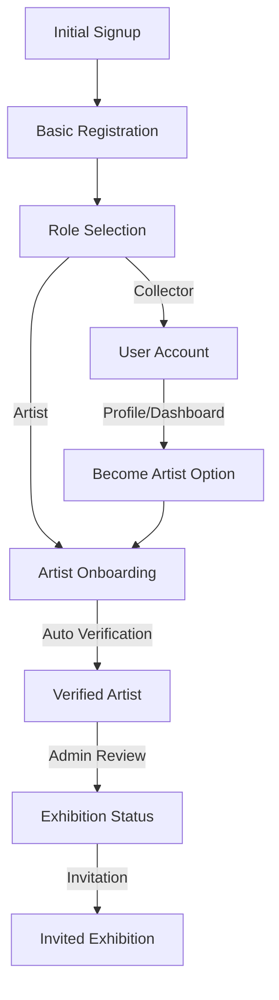

# Artist Role System

## Overview

The platform supports non-users, users (collectors) and artists (Verified and Emerging).

### The platform supports non-users

1. **Non-users**
   - Can browse featured artist. [x]
   - Can sign up as a user. [x]
   - Can view artist profiles? [Disucss]
   - Can view artist art? [Disucss]

### The platform supports users (collectors)

1. **Collectors**
   - Can browse featured artist. [x]
   - Can view artist profiles [x]
   - Can view artist art? [x]
   - Can follow artists [x]
   - Can send messages to artists [Discuss]
   - Can purchase art [x]
   - Can view their own profile [x]
   - Can commission art [x]  

### The platform supports artists

1. **Verified Artists**
   - Full platform access
   - Priority listing in artist directory
   - Verification badge
   - Full sales capabilities
   - Gallery integration features

2. **Emerging Artists**
   - Basic portfolio features
   - Community participation
   - Listed after verified artists
   - Path to verification
   - Limited feature set

## Database Structure

### Roles and Types

```sql
-- Enum types
public.user_role: 'verified_artist' | 'emerging_artist' | 'user' | 'admin'

-- Profile columns
role: public.user_role
artist_type: 'verified' | 'emerging' | null
```

### Views

```sql
public.profile_roles
- id: UUID
- mapped_role: user_role (maps 'artist' to 'verified_artist' for backward compatibility)
- original_role: user_role (original value)
```

### Helper Functions

```sql
public.is_artist(role_to_check public.user_role) returns boolean
-- Returns true for: 'artist', 'verified_artist', 'emerging_artist'
```

## Feature Access

### Verified Artists
- Full artwork management
- Sales capabilities
- Custom gallery profile
- Analytics access
- Direct collector messages
- Physical gallery integration
- Featured artwork spotlight
- Custom portfolio layout

### Emerging Artists
- Basic portfolio
- Limited artwork showcase
- Community participation
- Progress tracking
- Verification application
- Basic analytics

## Backward Compatibility

The system maintains backward compatibility through:
1. The `profile_roles` view that maps old roles to new ones
2. The `is_artist()` function that handles all artist role variations
3. RLS policies that support both old and new role names

## Role-Based Security

### RLS Policies
```sql
-- Example: Artwork updates
CREATE POLICY "Artists can update their own artworks"
ON public.artworks
FOR UPDATE
USING (
  auth.uid() = artist_id AND 
  EXISTS (
    SELECT 1 FROM public.profiles
    WHERE id = auth.uid()
    AND public.is_artist(role)
  )
);
```

## Verification Journey

Artists progress through the following stages:
1. Start as Emerging Artist
2. Complete verification requirements
3. Submit verification application
4. Review process
5. Upgrade to Verified Artist

Progress is tracked in the `verification_progress` table:
```sql
verification_progress
- current_step: TEXT
- steps_completed: TEXT[]
- next_steps: TEXT[]
- requirements_met: JSONB
```

## UI Components

The system includes UI components for:
- Artist badges (verified/emerging)
- Profile indicators
- Feature access controls
- Verification progress
- Role-specific layouts

## Best Practices

1. **Role Checks**
   ```typescript
   // Preferred: Use the is_artist function
   WHERE public.is_artist(role)
   
   // Instead of:
   WHERE role = 'artist'
   ```

2. **Feature Access**
   ```typescript
   // Check both role and artist_type
   const canAccessFeature = 
     profile.role === 'verified_artist' || 
     (profile.role === 'emerging_artist' && feature.isBasic);
   ```

3. **UI Display**
   ```typescript
   // Use the ArtistBadge component
   <ArtistBadge type={artist.artist_type} />
   ```

## Migration Notes

When adding new features:
1. Define access levels for both artist tiers
2. Update RLS policies using `is_artist()`
3. Use the `profile_roles` view for role mapping
4. Add feature flags to `artist_features` table
5. Update UI to reflect role-specific access 

## Registration and Onboarding Flow



### 1. Registration Flow [⚠️ PARTIAL]

#### A. Initial Signup [✅]
- Single unified registration flow [✅]
- Basic authentication (email/password) [✅]
- Create base user account [✅]
- Dark mode preference [✅]
- Email notification settings [✅]
- Initial access levels:
  - Browse featured artists [✅]
  - View public artist profiles [✅]
  - View available artworks [✅]
  - Access to AI Gallery Assistant [✅]

#### B. Role Selection [✅]
- Immediate prompt after signup [✅]
- Clear options: Collector or Artist [✅]
- Message: "You can change your role later via profile/dashboard" [✅]
- Default to "user" role if Collector selected [✅]
- Collector Features Enabled:
  - Follow artists [✅]
  - Favorite artworks [✅]
  - Access to purchase history [✅]
  - Full artwork price visibility [✅]
  - Direct artist messaging [ ]
  - Commission requests [ ]
  - Gallery visit tracking [✅]

### 2. Artist Onboarding Journey [⚠️ PARTIAL]

#### A. Educational Introduction [⚠️]
1. Explain Artist Tier System [✅]
   - Emerging Artist (starting point) [✅]
     - Limited to 10 artworks [✅]
     - Basic portfolio features [✅]
     - Community participation [✅]
     - Progress tracking [✅]
     - Basic analytics [ ]
     - Listed after verified artists [✅]
     - Basic artwork metadata [✅]
     - Basic portfolio layout [✅]
   - Verified Artist (automatic verification) [✅]
     - Unlimited artworks [✅]
     - Full platform features [✅]
     - Sales capabilities [✅]
     - Analytics access [ ]
     - Custom portfolio layout [✅]
     - Direct collector messages [ ]
     - Priority listing in directory [✅]
     - Full artwork management [✅]
     - Custom gallery profile [✅]
     - Featured artwork spotlight [✅]
   - Exhibition Status (admin review/invitation) [✅]
     - Physical gallery integration [✅]
     - Featured artwork spotlight [✅]
     - Priority listing in directory [✅]
     - Gallery QR code integration [ ]
     - Exhibition planning tools [ ]
     - Custom exhibition layout [ ]
     - Physical gallery analytics [ ]

2. Platform Features Overview [⚠️]
   - Multi-image upload system [✅]
   - Portfolio management [✅]
   - Stripe Connect integration (50% platform fee) [✅]
   - AI-powered features:
     - Artwork analysis [✅]
     - Price suggestions [ ]
     - Style detection [ ]
     - Marketing copy generation [ ]
   - Social Features:
     - Follow system [✅]
     - Activity feed [ ]
     - Community engagement [ ]
     - Collector relationships [✅]
     - Exhibition announcements [ ]

#### B. Verification Requirements Guide [⚠️]
1. Show all requirements upfront:
   - Profile completion requirements [✅]
     - Full name [✅]
     - Professional bio (minimum length) [✅]
     - Profile photo/avatar [✅]
     - Social links [✅]
     - Contact information [✅]
     - Exhibition history [✅]
   - Portfolio requirements [✅]
     - Minimum 5 artworks [✅]
     - High-quality images [✅]
     - Complete descriptions [✅]
     - Proper pricing [✅]
     - Multiple artwork views [✅]
     - Style categorization [ ]
   - Platform engagement [⚠️]
     - Account age > 30 days [ ]
     - 3 published artworks [✅]
     - Profile views threshold [ ]
     - Community participation [ ]
     - Collector interactions [ ]
   - Social media requirements [ ]
     - Sharing for extra image uploads [ ]
     - AI image analysis credits [ ]
     - Platform promotion [ ]
2. Progress tracking dashboard [✅]
3. Real-time status updates [✅]
4. Email notifications for milestones [✅]
5. Achievement badges system [ ]

#### C. Automatic Verification Process [⚠️]
- System monitors requirement completion [✅]
- Automatic upgrade when all requirements met [✅]
- Email notification on status change [✅]
- Dashboard updates with:
  - Current status [✅]
  - Progress indicators [✅]
  - Next steps [✅]
  - Requirements met/pending [✅]
  - Verification journey timeline [⚠️]
  - Achievement unlocks [ ]
  - Feature availability status [✅]

### 3. Exhibition Status Path [⚠️]

#### A. Two Entry Points [⚠️]
1. Admin Invitation [✅]
   - Direct invitation to all verified and emerging artists [✅]
   - Streamlined acceptance process [✅]
   - Gallery integration setup [⚠️]
   - QR code generation [⚠️]
   - Exhibition space allocation [ ]
   - Opening event planning [ ]
2. Artist Application [✅]
   - Available to verified artists [✅]
   - Admin review required [✅]
   - Portfolio review process [✅]
   - Exhibition planning tools [ ]
   - Space requirements [ ]
   - Duration preferences [ ]
   - Theme proposals [ ]

#### B. Gallery Integration Features [⚠️]
- Physical gallery check-in system [ ]
- Visit tracking [✅]
- Purchase history linking [✅]
- AI agent integration [ ]
- Analytics dashboard [ ]
- Custom QR codes for:
  - Artist profile [✅]
  - Gallery check-in [⚠️]
  - Artwork information [✅]
  - Exhibition details [ ]
  - Event schedules [ ]
  - Virtual tours [ ]
- Real-time visitor engagement [ ]
- Sales performance tracking [✅]
- Exhibition analytics [ ]

#### C. Future Enhancements [ ]
- AI-powered recommendations for exhibitions based on:
  - Artist style popularity [ ]
  - Sales performance [ ]
  - Gallery visitor engagement [ ]
  - Seasonal trends [ ]
  - Cultural events [ ]
- Advanced artwork matching [ ]
- Art education content [ ]
- Collection recommendations [ ]
- Purchase history analysis [ ]
- Virtual reality exhibitions [ ]
- Interactive installations [ ]
- Cross-gallery collaborations [ ]


